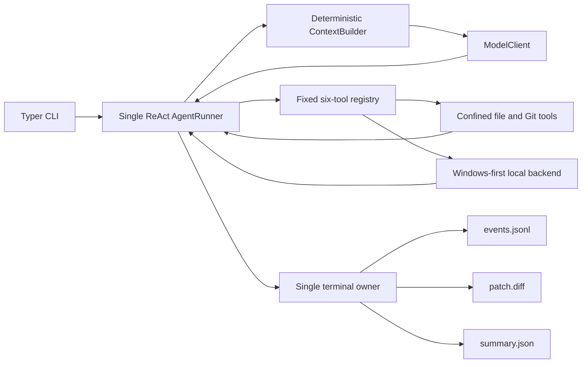

# Baseline Coding Agent

A small, inspectable Coding Agent that turns a task against a clean local Git repository into a tested patch and an auditable trajectory. The project is deliberately a baseline: its complete control loop fits in one runner, its tools are deterministic, and its claims are checked by tests and independent evaluation rather than model prose.

## Why this repository is useful

In one synchronous loop the agent can explore files, search and read code, apply checked edits, run controlled commands, observe failures, retry, and finish with three artifacts:

- `events.jsonl`: append-only, ordered run evidence;
- `patch.diff`: the repository diff from the starting commit;
- `summary.json`: status, limits, usage, steps, tools, changed files, and latest test evidence.

The current deterministic baseline solves all three included micro-tasks (3/3). This measures runtime and evaluation correctness—not general LLM capability. See [the checked-in report](benchmarks/baseline-scripted.json).

## Architecture



`Finalizer` is the only component that may write `AgentFinished` or `AgentFailed`. Completion, step limit, budget limit, cancellation, and failure all use that one path. Working context uses deterministic character budgets: file reads are keyed by path, rereads become most recent, and least-recently-read files are evicted first. There is no extra summarization model, embedding search, or semantic ranker.

## Install

Python 3.12+ and Git are required.

```powershell
python -m venv .venv
.\.venv\Scripts\Activate.ps1
python -m pip install -e ".[dev]"
```

## Three-minute offline demo

The scripted model makes the run reproducible and requires no API key. It still exercises the real runner, context builder, file tools, subprocess backend, Git diff, events, and finalizer.

```powershell
$demo = Join-Path $env:TEMP ("coding-agent-demo-" + [guid]::NewGuid().ToString("N"))
New-Item -ItemType Directory -Force $demo | Out-Null
Set-Content -Path (Join-Path $demo "calc.py") -Value "def add(a, b):`n    return a - b" -Encoding utf8
Set-Content -Path (Join-Path $demo "test_calc.py") -Value "from calc import add`n`ndef test_add():`n    assert add(2, 3) == 5" -Encoding utf8
Set-Content -Path (Join-Path $demo ".gitignore") -Value ".pytest_cache/`n__pycache__/" -Encoding utf8
git -C $demo init -b main
git -C $demo -c user.name=Demo -c user.email=demo@example.invalid add .
git -C $demo -c user.name=Demo -c user.email=demo@example.invalid commit -m initial
coding-agent run $demo --task "Fix add and verify it" --script examples/offline-script.json --artifacts-dir runs
```

Expected outcome: `Status: completed`, a non-empty `patch.diff`, one `AgentFinished` event, and a summary whose latest test result reports a passing pytest run.

To rerun the three-task independent baseline:

```powershell
python -m coding_agent.evaluation.baseline --output benchmarks/baseline-scripted.json
```

## Live model run

Only run trusted repositories: commands execute on the host and this MVP is **not a sandbox**.

```powershell
$env:OPENAI_API_KEY = "your-key"
coding-agent run C:\path\to\clean-repo --task "Fix issue #123 and run focused tests" --model gpt-5 --base-url https://api.openai.com/v1 --max-steps 20 --timeout 60
```

The target must be a Git repository with no staged or unstaged tracked changes. Configuration and artifacts never include the API key value. Use `coding-agent run --help` for all limits.

By default, run artifacts are written to a repository-sibling directory named `.<repository>-coding-agent-runs`. An explicit `--artifacts-dir` must also be outside the target repository so logs cannot enter exploration results or the generated patch.

## Tool surface

The model receives exactly six repository tools:

| Tool | Purpose |
|---|---|
| `list_files` | Deterministically list bounded repository paths |
| `search_code` | Search UTF-8 text with stable file/line ordering |
| `read_file` | Read a bounded line range and pin it into working context |
| `edit_file` | Exclusively create a file or replace one exact unique string |
| `run_command` | Run an allow-listed executable/argument prefix with `shell=False` |
| `git_diff` | Inspect the unified diff against the initial commit |

Expected operational failures become structured observations, so the next model step can repair them. The default command policy permits pytest through `python -m pytest` or `pytest`; startup code may supply additional immutable prefixes.

## Verification

```powershell
python -m pytest -q
ruff check .
ruff format --check .
mypy src/coding_agent
openspec.cmd validate build-coding-agent-mvp --strict
```

Tests cover domain transitions, terminal-event uniqueness, context retention/eviction, path confinement, checked edits, command policy, Windows process-tree cleanup, model parsing/retries, agent recovery and limits, CLI composition, three fixture oracles, and the complete offline loop.

## Reference-driven choices

- **mini-SWE-agent:** one understandable action → environment → observation loop and explicit termination.
- **SWE-agent:** separation between runtime trajectory, model-visible context, execution, and independent evaluation.
- **Aider:** checked edit application and budgeted repository context, simplified to explicit search/read and deterministic recency.
- **SWE-ReX:** a narrow execution protocol, implemented here only as a Windows-local backend.

The implementation borrows the trade-offs, not source code or a framework-sized architecture.

## V1 boundaries

This release intentionally excludes persistent memory, RepoMap/RAG, multi-agent orchestration, multiple strategies, worktrees, Docker or general sandboxing, MCP, skills, FastAPI, a web UI, distributed execution, run resumption, and SWE-bench runtime integration. SWE-bench Lite belongs in a later fixed Linux evaluation runner after real baseline failure modes justify the next change.

Known limitations: exact-string edits are less flexible than patch/hunk formats; context uses approximate character rather than tokenizer budgets; only UTF-8 text is supported; and the local command policy reduces accidental shell misuse but cannot make untrusted repository tests safe.
