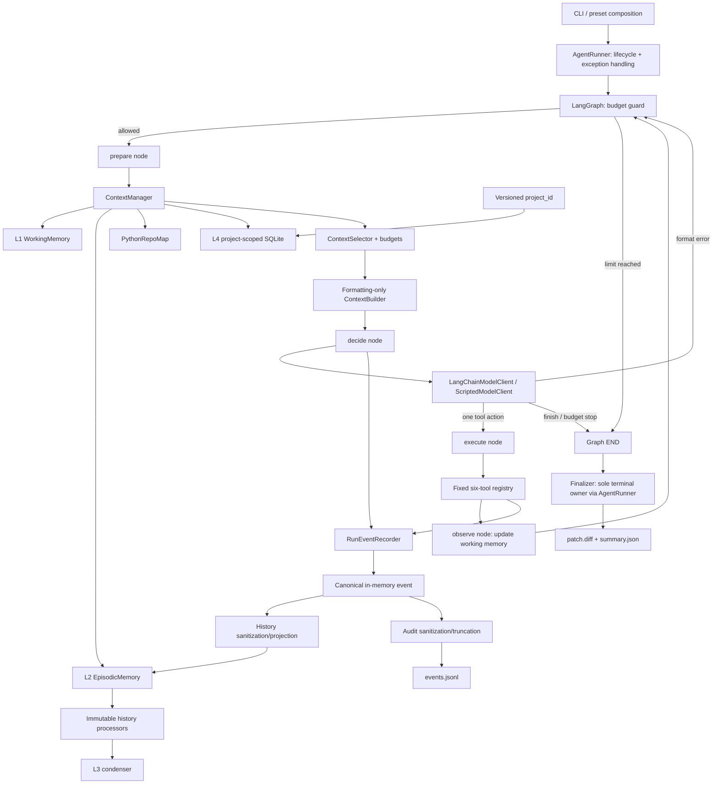

# Coding Agent with Hierarchical Context and Memory

A small, inspectable Coding Agent using **LangGraph** for a single-agent ReAct workflow and **LangChain** for model integration. It operates on a clean local Git repository and produces a patch, available test evidence and an auditable trajectory. Framework orchestration does not replace the project's tool policy, hierarchical memory or finalization boundaries.

## Why this repository is useful

In one synchronous loop the agent can explore files, search and read code, apply checked edits, run controlled commands, observe failures, retry, and finish with three artifacts:

- `events.jsonl`: append-only, ordered run evidence;
- `patch.diff`: the repository diff from the starting commit;
- `summary.json`: status, limits, usage, steps, tools, changed files, and latest test evidence.

The current deterministic baseline solves all three included micro-tasks (3/3). This measures runtime and evaluation correctness—not general LLM capability. See [the checked-in report](benchmarks/baseline-scripted.json).

## Architecture



`Finalizer` remains the only component that may write `AgentFinished` or `AgentFailed`. Runtime facts are created once, then independently projected to richer secret-free episodic history and stricter audit JSONL. The model-facing history never reads the audit-truncated payload.

The compiled graph has distinct `guard`, `prepare`, `decide`, `execute`, and `observe` nodes, composed as LangChain runnables. `AgentRunner` handles startup, exceptions and finalization around graph invocation; it no longer contains a handwritten ReAct loop. A business step counts one model decision, not one graph node. The recursion safety limit is derived from the configured business-step limit.

Live CLI composition uses LangChain `init_chat_model`, `ChatDeepSeek` / `ChatOpenAI`, message conversion and `bind_tools`. Registry Pydantic schemas remain the single tool-definition source and actual execution still goes through the original policy-enforcing registry. No checkpoint or implicit remote LangSmith tracing is enabled. Direct graph state/stream output is internal and is not sanitized like audit artifacts.

See [框架迁移阅读指南](docs/FRAMEWORK.md) for the node flow, code-reading sequence, verified dependency versions and retained boundaries.

The default `baseline` preset preserves the small deterministic runtime. Opt-in presets are `processor`, `condenser`, `repo-map`, `project-memory`, and `full`. `full` enables deterministic processing/condensation, static Python symbols, and validated cross-run project memory; it is not the default and will not become the default without comparative evaluation.

Project memory is stored in `project-memory.sqlite3` under the external artifact root. A versioned SHA-256 `project_id` prefers a credential-free canonical Git origin and otherwise uses the resolved Git common directory. Extractors can only propose typed candidates. Every proposal passes sanitization, policy, canonical-event/path provenance validation, normalization, and deduplication before the SQLite API accepts it. Optional LLM extractors and condensers can call a model only through the auxiliary gateway; their reported tokens/cost count separately and toward the combined Run limits.

## Install

Python 3.12+ and Git are required.

```powershell
python -m venv .venv
.\.venv\Scripts\Activate.ps1
python -m pip install -e ".[dev]"
```

## Three-minute offline demo

The scripted model makes the run reproducible and requires no API key. It still exercises the real runner, context builder, file tools, subprocess backend, Git diff, events, and finalizer.

```powershell
$demo = Join-Path $env:TEMP ("coding-agent-demo-" + [guid]::NewGuid().ToString("N"))
New-Item -ItemType Directory -Force $demo | Out-Null
Set-Content -Path (Join-Path $demo "calc.py") -Value "def add(a, b):`n    return a - b" -Encoding utf8
Set-Content -Path (Join-Path $demo "test_calc.py") -Value "from calc import add`n`ndef test_add():`n    assert add(2, 3) == 5" -Encoding utf8
Set-Content -Path (Join-Path $demo ".gitignore") -Value ".pytest_cache/`n__pycache__/" -Encoding utf8
git -C $demo init -b main
git -C $demo -c user.name=Demo -c user.email=demo@example.invalid add .
git -C $demo -c user.name=Demo -c user.email=demo@example.invalid commit -m initial
coding-agent run $demo --task "Fix add and verify it" --script examples/offline-script.json --artifacts-dir runs
```

Expected outcome: `Status: completed`, a non-empty `patch.diff`, one `AgentFinished` event, and a summary whose latest test result reports a passing pytest run.

To rerun the three-task independent baseline:

```powershell
python -m coding_agent.evaluation.baseline --output benchmarks/baseline-scripted.json
```

## DeepSeek low-budget configuration and trusted evaluation

Only run trusted repositories: commands execute on the host and this MVP is **not a sandbox**.

```powershell
$env:DEEPSEEK_API_KEY = "your-key"
coding-agent run C:\path\to\clean-repo --task "Fix the issue and run focused tests" --provider deepseek --max-steps 8 --max-tokens 12000 --max-output-tokens 1024 --timeout 60
```

The DeepSeek preset uses `https://api.deepseek.com`, `deepseek-flash`, and disabled thinking. These defaults were checked against [official API documentation](https://api-docs.deepseek.com/) on 2026-09-15; override `--model` / `--base-url` when needed. The factory defaults to non-thinking for required tools and rejects explicitly enabled DeepSeek thinking because required tool choice is incompatible with it. Request compatibility is tested through actual LangChain SDKs with mock HTTP, not a paid end-to-end run. Custom OpenAI-compatible configuration remains available with `--provider openai-compatible` and `OPENAI_API_KEY`, now also using LangChain. The older direct HTTP adapter remains available for compatibility but is not the CLI default.

Enable V2 context sources explicitly with `--memory-preset full`. The CLI only composes deterministic condensers/extractors; auxiliary LLM interfaces are extension seams, not enabled by budget flags. Output and step limits reduce exposure, but the post-response token threshold is not a billing hard cap.

The frozen `resume-v1` evaluator adds a stronger path than the single-repository CLI: 12 tasks run once each, generated patches are transferred to fresh judge repositories, and evaluator-owned hidden tests are installed only after transfer. It requires an ignored root `.env` and an explicit paid-run flag:

```powershell
$env:PYTHONPATH = 'src'
& '.venv/Scripts/python.exe' -m coding_agent.evaluation.live `
  --project-root . `
  --suite resume-v1 `
  --confirm-paid-run
```

The fixed live limits are DeepSeek Flash non-thinking, baseline memory, 8 decisions, 512 output tokens per request, an 8000 reported-token Run threshold, and zero auxiliary calls. A connectivity/infrastructure canary stops later calls; ordinary task failures remain in the denominator. CNY 15 is the operator authorization, not a billing hard limit. See [the evaluation protocol](docs/EVALUATION.md) before running it.

## Resume release and evaluation status

The trusted evaluator was run once on 2026-09-16. Under the frozen strict definition, complete task success was 0/12; 6/12 generated patches independently passed fresh-copy hidden tests, but no Run completed the finish protocol after repeated model format errors. The repository preserves this negative result rather than rerunning or selecting only successful patches. It is a 12-task microbenchmark, not a general coding success rate. See the [sanitized report](benchmarks/deepseek-live-resume-v1.json) and [interpretation](docs/EVALUATION.md). Generate the older read-only protocol with:

```powershell
python -m coding_agent.evaluation.plan
```

See [中文评测流程](docs/EVALUATION.md) for trusted hidden-test design, baseline/full ablations and budget semantics; see [简历描述与阅读路线](docs/RESUME.md) for honest project wording, interview topics and pending hardening. Offline engineering checks are configured in Windows CI, but CI execution itself is not claimed until the workflow runs.

The target must be a Git repository with no staged or unstaged tracked changes. Configuration and artifacts never include the API key value. Use `coding-agent run --help` for all limits.

By default, run artifacts are written to a repository-sibling directory named `.<repository>-coding-agent-runs`. An explicit `--artifacts-dir` must also be outside the target repository so logs cannot enter exploration results or the generated patch.

## Tool surface

The model receives exactly six repository tools:

| Tool | Purpose |
|---|---|
| `list_files` | Deterministically list bounded repository paths |
| `search_code` | Search UTF-8 text with stable file/line ordering |
| `read_file` | Read a bounded line range and pin it into working context |
| `edit_file` | Exclusively create a file or replace one exact unique string |
| `run_command` | Run an allow-listed executable/argument prefix with `shell=False` |
| `git_diff` | Inspect the unified diff against the initial commit |

Expected operational failures become structured observations, so the next model step can repair them. The default command policy permits pytest through `python -m pytest` or `pytest`; startup code may supply additional immutable prefixes.

## Verification

```powershell
python -m pytest -q
ruff check .
ruff format --check .
mypy src/coding_agent
openspec.cmd validate --all --strict
```

Tests cover domain transitions, terminal-event uniqueness, context retention/eviction, path confinement, checked edits, command policy, Windows process-tree cleanup, model parsing/retries, agent recovery and limits, CLI composition, three fixture oracles, and the complete offline loop.

## Reference-driven choices

- **mini-SWE-agent:** one understandable action → environment → observation loop and explicit termination.
- **SWE-agent:** separation between runtime trajectory, model-visible context, execution, and independent evaluation.
- **Aider:** checked edit application and budgeted repository context, simplified to explicit search/read and deterministic recency.
- **SWE-ReX:** a narrow execution protocol, implemented here only as a Windows-local backend.

The implementation borrows the trade-offs, not source code or a framework-sized architecture.

## Current boundaries

Cross-process resumption of run-local working, episodic, or condensed memory remains out of scope. The release also excludes multi-agent orchestration, vector databases, embeddings, Docker/general sandboxing, FastAPI/web UI, and distributed execution. SQLite persists only curated project knowledge, never resumable Run state.

Known limitations: exact-string edits are less flexible than patch/hunk formats; context uses approximate character rather than tokenizer budgets; only UTF-8 text is supported; and the local command policy reduces accidental shell misuse but cannot make untrusted repository tests safe.
