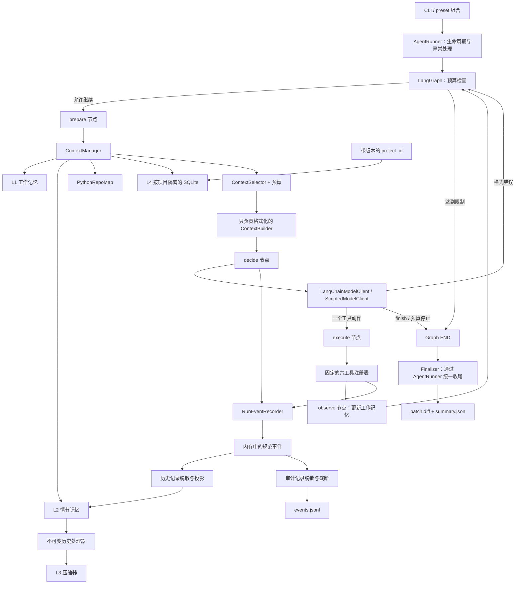

# Coding Agent：分层上下文与记忆

[English](README.md) | [简体中文](README.zh-CN.md)

这是一个规模较小、便于检查的 Coding Agent：使用 **LangGraph** 组织单 Agent ReAct 流程，使用 **LangChain** 接入模型。它在干净的本地 Git 仓库中执行任务，产出代码补丁、可用的测试证据和可审计的运行轨迹。框架负责流程编排；工具策略、分层记忆和运行结束时的产物写入仍由项目自身控制。

## 项目能做什么

在一次同步循环中，Agent 可以浏览文件、搜索和阅读代码、执行受检查的编辑、运行受控命令、观察失败并重试。每次运行最终生成三类产物：

- `events.jsonl`：按顺序追加的运行事件；
- `patch.diff`：相对于起始提交的仓库补丁；
- `summary.json`：状态、限制、用量、步骤、工具调用、改动文件和最近一次测试证据。

当前确定性基线完成了附带的 3 个微任务（3/3）。这个数字只验证运行框架和评测流程，不能代表真实模型的通用编码能力。参见[基线报告](benchmarks/baseline-scripted.json)。

## 架构



只有 `Finalizer` 可以写入 `AgentFinished` 或 `AgentFailed`。运行事实只创建一次，再分别投影为信息较丰富、已去除密钥的情节历史，以及限制更严格的审计 JSONL。模型看到的历史不会从已截断的审计数据中重建。

编译后的图包含独立的 `guard`、`prepare`、`decide`、`execute` 和 `observe` 节点，并由 LangChain runnable 组合。`AgentRunner` 在图外处理启动、异常和收尾；一个业务步骤指一次模型决策，而非一个图节点。递归安全上限由业务步骤上限推导。

实时 CLI 使用 LangChain 的 `init_chat_model`、`ChatDeepSeek` / `ChatOpenAI`、消息转换和 `bind_tools`。工具定义仍以注册表中的 Pydantic schema 为唯一来源，实际执行仍经过原有的策略注册表。项目没有启用 checkpoint 或隐式远程 LangSmith tracing；直接读取的图状态和流输出是内部数据，不具备审计产物的脱敏保证。节点流程、代码阅读顺序和已验证依赖版本见[框架迁移阅读指南](docs/FRAMEWORK.md)。

默认 `baseline` preset 保留精简的确定性运行方式。可选 preset 为 `processor`、`condenser`、`repo-map`、`project-memory` 和 `full`。`full` 启用确定性历史处理与压缩、静态 Python 符号索引，以及经校验的跨运行项目记忆；在比较评测完成前不会改为默认值。

项目记忆保存在外部产物根目录下的 `project-memory.sqlite3`。带版本的 SHA-256 `project_id` 优先使用去除凭据后的规范 Git origin，否则使用解析后的 Git common directory。提取器只能提出有类型的候选记录；候选记录必须通过脱敏、策略、规范事件及路径来源校验、规范化和去重，才能写入 SQLite。可选的 LLM 提取器和压缩器只能通过辅助模型网关调用模型，其 token 和费用分别统计，同时计入整个 Run 的合并上限。

## 安装

需要 Python 3.12+ 和 Git。

```powershell
python -m venv .venv
.\.venv\Scripts\Activate.ps1
python -m pip install -e ".[dev]"
```

## 三分钟离线演示

脚本模型使运行可复现，且不需要 API Key。演示仍会经过真实的 Runner、上下文构建、文件工具、子进程后端、Git diff、事件记录和 Finalizer。

```powershell
$demo = Join-Path $env:TEMP ("coding-agent-demo-" + [guid]::NewGuid().ToString("N"))
New-Item -ItemType Directory -Force $demo | Out-Null
Set-Content -Path (Join-Path $demo "calc.py") -Value "def add(a, b):`n    return a - b" -Encoding utf8
Set-Content -Path (Join-Path $demo "test_calc.py") -Value "from calc import add`n`ndef test_add():`n    assert add(2, 3) == 5" -Encoding utf8
Set-Content -Path (Join-Path $demo ".gitignore") -Value ".pytest_cache/`n__pycache__/" -Encoding utf8
git -C $demo init -b main
git -C $demo -c user.name=Demo -c user.email=demo@example.invalid add .
git -C $demo -c user.name=Demo -c user.email=demo@example.invalid commit -m initial

coding-agent run $demo --task "Fix add and verify it" --script examples/offline-script.json --artifacts-dir runs
```

预期结果：显示 `Status: completed`，`patch.diff` 非空，出现一条 `AgentFinished` 事件，且摘要中的最近一次 pytest 结果为通过。

重新运行三个任务的独立基线：

```powershell
python -m coding_agent.evaluation.baseline --output benchmarks/baseline-scripted.json
```

## DeepSeek 配置与可信评测

**只在可信仓库中运行：命令会在宿主机上执行，本项目当前不提供沙箱。**

```powershell
$env:DEEPSEEK_API_KEY = "your-key"
coding-agent run C:\path\to\clean-repo --task "Fix the issue and run focused tests" --provider deepseek --max-steps 8 --max-tokens 12000 --max-output-tokens 1024 --timeout 60
```

DeepSeek preset 默认使用 `https://api.deepseek.com`、`deepseek-flash` 和非思考模式。这些默认值在 2026-09-15 对照[官方 API 文档](https://api-docs.deepseek.com/)核对；必要时可用 `--model` / `--base-url` 覆盖。工厂默认关闭思考模式，因为显式启用 DeepSeek 思考模式与必选工具调用不兼容。请求兼容性通过真实 LangChain SDK 加模拟 HTTP 验证，尚未针对该配置进行付费端到端运行。也支持 `--provider openai-compatible` 和 `OPENAI_API_KEY`；旧版直接 HTTP 适配器保留用于兼容，但不是 CLI 默认实现。

使用 `--memory-preset full` 才会启用 V2 上下文来源。CLI 仅组合确定性压缩器和提取器；辅助 LLM 接口是扩展点，不会因为设置预算标志而自动启用。输出与步骤限制可以降低消耗，但响应后的 token 阈值不是费用硬上限。

## 本地 FastAPI 接口

API 与 CLI 共用 `AgentRunner` 和产物 Finalizer。它使用单独固定的 DeepSeek 基线配置：**8 步、每个 Run 16,000 个已报告 token、每次模型响应最多 1,024 个输出 token**。既有真实评测仍使用冻结的 8,000/512 限制。16,000 token 是响应后检查的阈值，不是服务商账单硬上限。

安装项目，在进程环境或启动目录中被忽略的 `.env` 文件内设置 `DEEPSEEK_API_KEY`，然后启动本地服务：

```powershell
python -m pip install -e ".[dev]"
coding-agent-api
```

在另一个终端向**可信且干净的 Git 仓库**提交任务，并轮询返回的 `status_url`：

```powershell
$body = @{ repository = 'C:\path\to\clean-repo'; task = 'Fix the issue and run focused tests' } | ConvertTo-Json
$run = Invoke-RestMethod -Method Post -Uri 'http://127.0.0.1:8000/runs' -ContentType 'application/json' -Body $body
Invoke-RestMethod -Uri ('http://127.0.0.1:8000' + $run.status_url)
Invoke-RestMethod -Uri ('http://127.0.0.1:8000/runs/' + $run.run_id + '/result')
```

`POST /runs` 返回 HTTP 202 和 Run ID。`GET /runs/{id}` 返回排队、运行中或最终状态；结束后，`GET /runs/{id}/result` 返回已有的 `summary.json` 和补丁地址，`GET /runs/{id}/patch` 下载 `patch.diff`。同一仓库同时提交第二个活跃任务会返回 HTTP 409。API 不接受请求中传入密钥或消费上限，不持久化任务索引，也不会在进程重启后恢复任务。服务应只使用一个 worker、只绑定 `127.0.0.1`，不要暴露给不可信网络。

冻结的 `resume-v1` 评测器包含 12 个任务：每题运行一次，将生成的补丁转移到全新的判题仓库，之后才安装由评测器掌管的隐藏测试。运行需要根目录下被忽略的 `.env` 和明确的付费运行标志。下面是命令形式；历史报告的复现参数与单独批准的运行记录详见[评测流程](docs/EVALUATION.md)。

```powershell
$env:PYTHONPATH = 'src'
& '.venv/Scripts/python.exe' -m coding_agent.evaluation.live `
  --project-root . `
  --suite resume-v1 `
  --confirm-paid-run
```

固定限制为 DeepSeek Flash 非思考模式、`baseline` 记忆、8 次决策、每请求 512 个输出 token、每 Run 8,000 个已报告 token 阈值，以及零次辅助调用。连接或基础设施的 canary 失败会阻止后续调用；普通任务失败仍计入分母。人民币 15 元是操作者授权额度，不是账单硬上限。

## 评测结果与项目状态

2026-09-16，对同一份冻结的 12 题 `resume-v1` 清单进行了三轮分别批准的真实模型评测。每轮每题只运行一次，结果如下：

| 指标 | [第一轮](benchmarks/deepseek-live-resume-v1.json) | [第二轮](benchmarks/deepseek-live-resume-v2.json) | [第三轮](benchmarks/deepseek-live-resume-v3.json) |
|---|---:|---:|---:|
| 严格成功：正常 finish、补丁可应用且通过隐藏判题 | 0/12 | 6/12 | 5/12 |
| 补丁通过全新仓库中的隐藏判题 | 6/12 | 10/12 | 11/12 |

这是一组微任务结果，不能外推为通用编码成功率。第一轮的 6 个补丁虽通过隐藏判题，但 Run 都未完成结束协议；后续两轮保留为独立报告，没有覆盖历史结果。各轮限制、格式错误、token 用量和结果解释见[中文评测流程](docs/EVALUATION.md)。

生成较早的只读评测方案：

```powershell
python -m coding_agent.evaluation.plan
```

[简历描述与阅读路线](docs/RESUME.md)记录了适合陈述的项目范围、面试话题与待加强部分。Windows CI 已配置离线工程检查；在工作流实际运行前，不宣称 CI 已通过。

目标仓库必须是没有已暂存或未暂存的受跟踪文件改动的 Git 仓库。配置和运行产物不会包含 API Key 的值。所有参数可通过 `coding-agent run --help` 查看。

默认产物放在目标仓库同级的 `.<repository>-coding-agent-runs` 目录。显式指定的 `--artifacts-dir` 也必须位于目标仓库外，以免日志混入代码探索结果或生成补丁。

## 工具范围

模型只会接收到以下六个仓库工具：

| 工具 | 用途 |
|---|---|
| `list_files` | 按确定顺序列出数量受限的仓库路径 |
| `search_code` | 按稳定的文件与行号顺序搜索 UTF-8 文本 |
| `read_file` | 读取受限的行范围，并固定到工作上下文 |
| `edit_file` | 仅创建文件或替换一处完全匹配且唯一的字符串 |
| `run_command` | 用 `shell=False` 运行前缀在允许列表内的程序和参数 |
| `git_diff` | 查看相对起始提交的统一格式 diff |

预期内的操作失败会转为结构化观察结果，供下一次模型决策修复。默认命令策略允许通过 `python -m pytest` 或 `pytest` 运行测试；启动代码可以额外提供不可变的命令前缀。

## 验证

```powershell
python -m pytest -q
ruff check .
ruff format --check .
mypy src/coding_agent
openspec.cmd validate --all --strict
```

测试覆盖领域状态转换、唯一终止事件、上下文保留与淘汰、路径约束、受检查的编辑、命令策略、Windows 进程树清理、模型解析与重试、Agent 恢复与上限、CLI 组合、三个样例判题器以及完整离线流程。

## 参考项目与取舍

- **mini-SWE-agent**：清晰的“动作 → 环境 → 观察”循环和显式终止。
- **SWE-agent**：运行轨迹、模型可见上下文、执行和独立评测的分离。
- **Aider**：受检查的编辑应用与有预算的仓库上下文；本项目将其简化为显式搜索、读取及确定性的近期信息选择。
- **SWE-ReX**：较窄的执行协议；本项目只实现了 Windows 本地后端。

实现借鉴这些设计取舍，没有复制其源代码或整体框架结构。

## 当前边界

目前不支持跨进程恢复单次 Run 的工作记忆、情节记忆或压缩记忆。项目也不包含多 Agent 编排、向量数据库、embedding、Docker 或通用沙箱、Web UI、分布式执行。FastAPI 封装只面向本地单进程使用；SQLite 仅持久化经过筛选的项目知识，不保存可恢复的 Run 状态。

已知限制：精确字符串编辑不如 patch/hunk 格式灵活；上下文预算按近似字符数而非 tokenizer 计算；只支持 UTF-8 文本；本地命令策略可减少误用 shell 的风险，但不能使不可信仓库中的测试变得安全。
