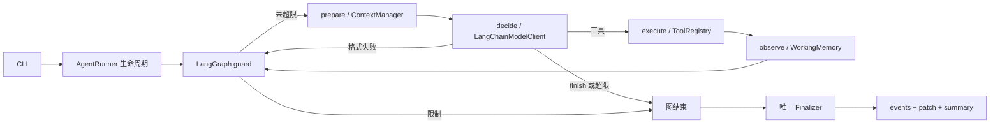

# 框架迁移阅读指南

## 现在框架实际负责什么

LangGraph 控制完整 ReAct 循环及条件路由，而不是在旧 while 循环外套一个节点。LangChain 提供节点 runnable、模型集成、消息对象和工具绑定。项目自己的 runtime 仍负责工具安全、记忆取舍、证据和产物。

## 建议阅读顺序

1. `agent/graph.py`：五个节点、两处 conditional edges；`guard` 清除 response/result，避免格式错误后重复执行旧动作；`decide` 按报告 usage 再检查预算，超限后不会执行返回的工具。
2. `agent/runner.py`：外层 lifecycle，启动 context、调用 compiled graph、处理异常、结束 memory、最后 finalize。一个业务 step 是一次模型决策，不是一次节点执行。graph recursion 上限为 `max_steps * 5 + 10`。
3. `models/langchain_client.py`：`init_chat_model` 选择 provider，`bind_tools` 绑定工具，AIMessage 解码成 ModelResponse；缺调用、多调用、解析失败都转为格式错误，usage 只累计一次，cost 未知仍为未知。
4. `models/tool_binding.py` 与 `tools/registry.py`：前者仅转换 schema，后者仍是参数校验与实际执行的权威。LangChain 不会绕过命令策略直接运行 shell。finish 不是文件工具。
5. `tests/behavior/test_graph_runtime.py` 与 `tests/unit/models/test_langchain_client.py`：图实际节点路由、长循环、收尾异常、旧动作不重放、真实 SDK + mock HTTP 的请求验证。

## 为什么保留原来的记忆

LangGraph state 只承载 RunState 与本轮瞬态数据，不额外累积另一份 message history。ContextManager 仍组合 Working/Episodic Memory、摘要、Repo Map 和项目记忆；原有 canonical event 分别投影 history/audit。这样框架编排不会让上下文无限增长，也不会让 audit 的强截断成为模型 history 的唯一来源。

没有启用 checkpointer、跨进程恢复、框架默认 memory 或远程 LangSmith tracing。graph state 中 RunState 是本地可变对象，不适合 checkpoint/replay；直接 `graph.stream` 是内部调试输出，不是经过审计脱敏的用户日志。ReAct 代表动作/观察迭代，不代表保存模型内部思维链。

## 验证和边界

运行 `python -m pytest -q` 检查工程行为，或 `python -m coding_agent.evaluation.baseline --output runs/framework-smoke.json` 执行离线脚本演示。两者均不会调用收费模型，但脚本成功不代表 DeepSeek 自主任务成功。

本地验收环境：Windows、Python 3.14.6；LangChain 1.4.0、LangGraph 1.2.11、langchain-core 1.6.3、langchain-openai 1.6.2、langchain-deepseek 1.1.0。项目声明支持 Python 3.12+，CI 配置为 3.12；该 CI 尚未在本地执行，不能将本地 3.14 的结果描述为 3.12 也已验证。

现有记忆的预算细节、语义证据匹配、Repo Map confinement 和辅助 LLM 完整失败计费等仍见 OpenSpec 待办，本次框架迁移不宣称解决所有历史设计缺口。实际账单硬限额和真实模型评测仍未实现/执行。
