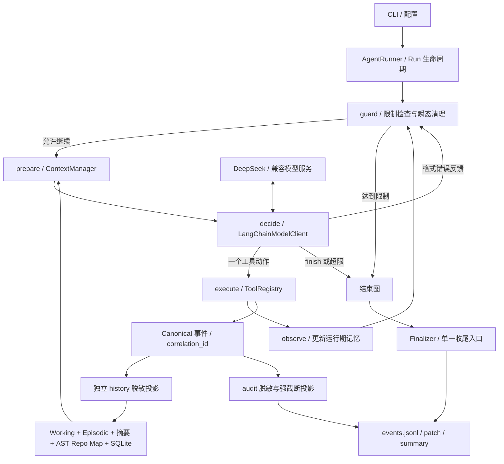

# Coding Agent 面试准备手册

依据当前仓库实现整理，日期：2026-09-15。这是讲述与练习材料，不是新的功能承诺。涉及个人贡献时按真实经历调整；不要把框架、参考代码或 AI 辅助完成的工作描述为自己从零原创。

## 1. 先抓住项目主线

一句话：这是一个基于 LangChain 与 LangGraph 的本地单智能体 ReAct Coding Agent，把模型决策放进受约束、可观察、可停止的编码执行闭环。

技术栈：Python、LangChain、LangGraph、Pydantic、SQLite、pytest。DeepSeek 是接入的模型服务；Tool Calling 是交互机制；Git 是工程工具。ReAct 不是 React 前端框架。

你要讲清的不是“用了很多框架”，而是：模型不可靠时，应用如何限制动作、选择上下文、处理失败、保存证据，以及验证结果。

### 60 秒讲述稿

> 我做的是一个本地 Coding Agent，支持读取和搜索代码、精确修改文件、执行允许的测试命令，并生成事件日志、Git Patch 和结构化报告。
>
> 架构采用单智能体 ReAct：每轮模型决定一个动作，执行工具后把观察结果用于下一轮。LangGraph 负责预算检查、上下文准备、模型决策、工具执行和结果观察的条件路由；LangChain 负责模型接入、消息转换和工具绑定。
>
> 我重点关注三个工程问题：第一，用 Pydantic 参数校验、路径检查和命令白名单约束执行；第二，用运行期记忆、历史摘要、Repo Map 和 SQLite 项目记忆控制上下文；第三，统一事件记录和最终收尾，让失败也能留下可检查的证据。
>
> 当前完成了百余项离线工程测试和脚本演示，也设计了真实模型测评流程，但还没有做 DeepSeek 自主编码效果测评，所以不报告成功率或 token 节省比例。

### 3 分钟展开顺序

1. **场景**：针对可信的本地 Python 仓库做小范围代码修改与测试，不是通用自主软件工程平台。
2. **流程**：任务进入 RunState；图检查限制；ContextManager 组装消息；模型返回一个结构化动作；Registry 校验执行；观察进入记忆，再循环。
3. **约束**：限制步数、已报告 token 和可选费用预算；格式错误可反馈恢复；超限响应中的工具不执行；最终统一生成产物。
4. **上下文**：不无限拼接对话，不把审计日志直接当模型历史；不同来源选择后进入上下文，持久化候选先校验。
5. **验证与不足**：离线测试验证控制流和协议，不证明真实模型能力；下一步是可信 hidden oracle 测评、预算细化和安全 hardening。

## 2. 能在白板上画出的架构



这是一张概念图，不表示每个事件都由 execute 产生。模型、生命周期和工具都可以记录事件；工具相关事件共享关联标识。图内节点不各自生成一套终止日志。

| 模块 | 实际职责 | 优先阅读代码（相对仓库根目录） |
| --- | --- | --- |
| 状态图 | 五节点、条件边、预算停止、格式错误回路 | `src/coding_agent/agent/graph.py` |
| 生命周期 | 调用图、异常处理、记忆收尾、最终产物 | `src/coding_agent/agent/runner.py` |
| 模型适配 | bind_tools、AIMessage 解码、usage 映射 | `src/coding_agent/models/langchain_client.py` |
| 工具契约 | registry schema 转换，不复制参数定义 | `src/coding_agent/models/tool_binding.py`、`src/coding_agent/tools/registry.py` |
| 执行约束 | 相对路径解析、命令前缀白名单 | `src/coding_agent/tools/paths.py`、`src/coding_agent/execution/policy.py` |
| 上下文 | 来源组合与预算选择 | `src/coding_agent/context/manager.py`、`src/coding_agent/context/selector.py` |
| 事件边界 | canonical 到 history/audit 的独立投影 | `src/coding_agent/events/recorder.py`、`src/coding_agent/events/projections.py` |
| 项目记忆 | 提取候选、校验晋升、隔离存储 | `src/coding_agent/memory/candidates.py`、`promotion.py`、`persistent.py`、`identity.py` |
| 测试证据 | 路由、错误、预算、真实 SDK 的 mock HTTP | `tests/behavior/test_graph_runtime.py`、`tests/unit/models/test_langchain_client.py` |
| 测评设计 | 计划与脚本回归的边界 | `docs/EVALUATION.md`、`src/coding_agent/evaluation/plan.py` |

## 3. 高频问题与可直接练习的回答

先说结论，再说实现，最后说限制。下面每题控制在 30～60 秒，不要逐字背诵所有细节。

### 架构与框架

**Q1：为什么是 ReAct，不是 Plan-and-Execute？**

编码任务经常需要看到代码和测试失败后才知道下一步。当前每轮决策一个动作，再根据观察调整，更适合小范围迭代修复。没有独立 Planner 或完整计划执行器，也没有持久化模型内部思维链。长任务规划可能有价值，但当前未实现。

**Q2：为什么不是多智能体？**

当前主要验证一个编码闭环的可靠性。单 Agent 的状态、预算、事件归属更简单。并未证明多 Agent 能提高这个任务集的效果，因此没有为丰富名词引入多个角色。旅行助手的业务任务拆分适合另一种编排方式。

**Q3：LangChain 和 LangGraph 分别做什么？**

LangChain 负责模型集成、消息对象、工具绑定和 runnable；LangGraph 负责状态图、节点与条件路由。路径安全、命令限制、候选记忆校验、上下文取舍和最终产物仍由项目代码负责。框架没有自动解决这些问题。

**Q4：是不是在旧 while 循环外包了一层框架？**

不是。完整循环在 compiled StateGraph 内，包含 guard、prepare、decide、execute、observe 和条件边。Runner 只管理外层生命周期。可以对照 graph.py 和图运行行为测试验证，而不只看依赖文件。

**Q5：为什么不直接使用现成的 create_agent？**

本项目需要显式控制每轮动作数、错误路由、使用量检查和唯一收尾入口，因此选择较底层的状态图。不是说高级封装做不到，而是这里显式表达更便于学习和测试。小项目直接 while 循环也能满足需求，迁移没有经过性能收益测评。

**Q6：StateGraph state 保存什么？有 reducer 吗？**

保存 RunState 和本轮 messages、response、result。这里没有使用追加消息 reducer 建第二份无限历史；ContextManager 是上下文入口。guard 清理瞬态数据，避免格式错误后误执行上一轮工具结果。LangGraph 的节点返回状态更新，未配置 reducer 的字段默认替换，参见 [官方 Graph API](https://docs.langchain.com/oss/python/langgraph/graph-api)。

**Q7：支持断点恢复吗？**

不支持跨进程 Run 恢复。虽然 LangGraph 有相关能力，项目没有启用 checkpointer，RunState 也是本地可变对象。若要增加恢复，需要可序列化状态、工具副作用幂等性、恢复后的预算和事件一致性设计，不能只添加一个 saver 就宣称完成。

**Q8：agent step 和 graph step 一样吗？**

不一样。业务 step 是一次模型决策，格式错误也算；一轮经过多个图节点。递归上限设置为 `max_steps * 5 + 10`，给节点执行留余量，业务限制仍由 guard 控制。最后一个允许步骤返回 finish 时直接结束，不会被误判为步数耗尽。

### Tool Calling 与执行可靠性

**Q9：Tool Calling 怎么落地？**

权威工具 schema 来自 Registry/Pydantic，适配层转换后 bind_tools，模型必须返回一个调用。解析为 ToolAction 或 FinishAction 后，再由 Registry 校验实际执行参数。结构化输出减少解析歧义，但不能保证参数正确或工具决策合理。

**Q10：为什么强制一次一个工具？并行不是更快吗？**

一次一个动作简化了副作用顺序、观察反馈、预算和关联事件。编辑后测试通常有依赖；并行写文件还需要冲突控制。没有把“一次一个”说成普遍最优，未来可为独立只读操作设计并行策略。

**Q11：模型不按格式输出怎么办？**

无调用、多调用、非法参数或解析异常转成 ModelFormatError，记录错误观察后返回 guard，允许下一轮纠正，仍消耗业务步骤。未知工具在 Registry 返回结构化错误。格式恢复不是无限重试，最终受 Run 限制约束。

**Q12：怎么防止重复执行上一轮 edit？**

guard 清空本轮 messages、response、result；decide 的错误路由不进入 execute。行为测试覆盖有效动作后接格式错误的情况。这里是控制流防重放，不是跨进程、分布式 exactly-once 保证。

**Q13：工具有哪些？finish 算工具吗？**

六个执行工具：list_files、search_code、read_file、edit_file、run_command、git_diff。finish 是协议上的结束动作，不执行文件操作。git_diff 只检查差异，不自动提交。

**Q14：edit_file 如何避免乱改？**

创建文件采用排他创建；替换要求期望字符串在文件中唯一匹配。找不到或出现多个匹配就失败，不盲目覆盖。它不是通用 patch/AST 重构引擎，也不能证明修改语义正确，需要看 diff 和测试。

**Q15：有什么安全防护？能跑陌生仓库吗？**

文件工具拒绝绝对路径，解析后要求路径仍在仓库内，用于约束 `..` 和所检查路径的符号链接逃逸。命令使用允许的可执行文件/参数前缀，禁止 shell 控制符和环境赋值，shell=False，并有超时和输出限制。

但这不是沙箱：pytest 会执行仓库里的 Python，仍可能访问宿主机文件或网络。当前只应运行可信仓库；Repo Map 扫描边界还需强化。陌生仓库应先增加隔离执行环境，不能靠白名单宣称安全。

**Q16：任务 completed 就表示代码正确了吗？**

不是。completed 表示模型发出 finish 并正常结束协议；模型可能错误宣称完成。正确性需要外部可信测试或明确验收。终止状态、可见测试结果、可信任务成功率是三个不同指标。

### 记忆、检索与上下文

**Q17：为什么分层记忆？**

来源的生命周期不同：Working Memory 存本轮近期文件和观察；Episodic Memory 存运行事件；Condenser 压缩旧历史；Repo Map 提供代码结构；Persistent Memory 提供跨 Run 的项目记录。ContextManager 统一选择，不把所有内容无条件塞入提示词。

**Q18：项目记忆是不是 RAG？用了向量数据库吗？**

当前没有向量数据库或 embedding。AST Repo Map 是 Python 静态结构与词面相关性；SQLite 项目记忆是关键词、可选 FTS 与重要性/置信度排序。可以称检索增强上下文，但不能包装成 Milvus 向量 RAG，也没有证明检索提升幅度。

**Q19：为什么选 SQLite，而不是 Redis/Milvus？**

本地单进程、结构化记录、低部署成本，更适合 SQLite。project_id、类型、状态和去重键适合关系约束。向量库主要解决语义检索，不是持久化的必需品；大规模并发服务或语义匹配需求出现后再评估替换。

**Q20：怎么避免模型把幻觉写进长期记忆？**

Extractor 只能提出 candidate，不能直接写 store。候选要经过脱敏、policy、来源引用校验、规范化与去重，再转成可持久化记录。当前来源校验检查 run、事件序号和路径归属，不验证内容与证据语义一致，所以不能说完全解决幻觉污染。

当前 CLI 的确定性提取主要保存 finish 的 Run Summary。定义了更多记忆类型，不代表已自动准确提取全部架构与约定；可选 LLM structured extraction 仍是扩展方向。

**Q21：project_id 怎么算？**

有 origin 时对 canonical remote 做带版本的 SHA-256；去掉凭据、查询片段、`.git` 尾缀等。没有 remote 时使用规范化 Git common-dir，因此同仓库 linked worktree 可保持一致。不是用目录名或 Run ID。

不同 Run 可以匹配同项目，检索带 project_id 隔离。实际跨 Run 读取还要求访问同一存储位置。HTTPS 与 SSH 并非完全统一；无 remote 仓库移动目录可能改变 ID；哈希不是加密。

**Q22：怎么去重？**

规范化空白、大小写后计算内容 hash，通过 `(project_id, type, normalized_hash)` 唯一约束去重；重复确认更新部分元信息。这是精确规范化去重，不是语义去重，也没有自动合并所有证据或处理矛盾知识。

**Q23：Condenser 是 LLM 总结吗？会丢信息吗？**

默认是确定性滑动窗口和有界旧事件摘要，保留近期事件，切分时避免拆开边界关联组。摘要只保留部分旧事件片段，必然可能丢细节；覆盖区间的元数据不等于保存了全部事实。LLM condenser 有扩展接口，但没有在当前 CLI 默认接入收费调用。

**Q24：字符预算就是 token 预算吗？**

不是。上下文选择主要用字符约束近似控制体积；Run 的 token 预算依据模型 usage。最终格式化 header/omission 的精确预算、严格 section 配额和最新事件显式优先级仍有待完善。不能声称已经实现 tokenizer 级严格上下文上限。

### 事件、预算与测评

**Q25：audit 和 model history 为什么分开？**

Recorder 先创建一次 canonical event，分配序号、run_id 和关联信息，然后独立投影：audit 脱敏并强截断字符串，history 脱敏但不继承 audit 的强截断。模型历史不从截断 JSONL 反向重建，避免为了审计限制丢掉模型需要的观察。

这不意味着所有原始输出都永久保存；工具本身可能已限长。配置 secret 脱敏也不是通用 DLP。直接 graph.stream 的内部状态不是经过同等保护的用户日志；框架 tracing 当前关闭。

**Q26：为什么统一 Finalizer？异常时有产物吗？**

图负责业务状态，Runner 管理异常和记忆结束，Finalizer 是唯一终止事件与产物生成入口，减少正常/错误分支分别收尾导致遗漏。context 启动放在异常保护内，记忆收尾失败也不应覆盖已完成结果。磁盘或 patch 生成失败仍有边界，不宣称任何故障都必定完整落盘。

**Q27：预算怎么实现？是账单硬上限吗？**

guard 请求前检查步数和累计 usage，decide 响应后累计输入/输出 token，再检查；超限时不执行返回的工具。费用未知保持未知，有费用上限时保守停止。

不是预付费硬上限：最后一次响应可能越过 token 阈值，SDK 重试及失败/格式错误请求计费还不完整。auxiliary LLM 应共享总预算或有明确独立 hard limit；当前未接线的扩展不能说已具备完整生产计费。

**Q28：DeepSeek 为什么关闭 thinking？**

当前工具协议要求 `tool_choice="required"`。按 [DeepSeek Chat Completion 文档](https://api-docs.deepseek.com/api/create-chat-completion/)，该设置不支持 thinking 模式；factory 因此关闭 thinking 并拒绝冲突配置。非思考模式与输出上限也符合低成本目标，但没有真实账单数据证明省了多少。

**Q29：现在测了什么？什么没测？**

已测图路由、步骤限制、错误恢复、工具参数与执行、记忆晋升、事件投影、CLI 和产物等工程行为。模型适配有真实 SDK 加 mock HTTP 的请求/解析测试，不是收费模型 E2E。

最近记录的全量运行是 148 项通过，随后新增一项边界测试单独通过；不能把它说成已重新全量跑过 149 项。脚本演示 3/3 只说明预设动作能跑通，不能推导自主模型成功率。当前未做真实 DeepSeek 效果测评，也没测 token 节省。

**Q30：如果让你设计真实 evaluation？**

先冻结任务、初始 fixture、验收标准和预算；baseline/full 使用同一任务与模型配置、独立初始目录和存储，避免记忆污染。模型完成后，把 patch 应用到新副本，由外部可信 hidden tests 判题，不让 Agent 修改判题 oracle。

报告可信任务通过率、patch 可应用率、回归结果、失败分类、token、费用和耗时；样本少时报告逐任务结果而不是过度概括。跨 Run 记忆另做 A 写入/B 同项目复用/C 不同项目隔离实验。当前只有流程设计，没有这些实验结果，详见 `docs/EVALUATION.md`。

**Q31：full mode 为什么不是默认？下一步做什么？**

baseline 更简单，便于对照。额外记忆可能带来噪声、陈旧信息和更长上下文，没有测评就不应默认开启全部功能。先做可信评测，再处理记忆语义证据、扫描边界、精确预算、DB 生命周期和辅助调用计费；跨进程恢复仍不在当前范围。

## 4. 三个可讲的工程案例

只在能对照代码和测试讲清楚时使用。结果描述为修复了具体边界，不编造线上事故、用户规模或百分比收益。

### 案例 A：脱敏与截断顺序

- 问题：若先截断，secret 只剩前缀，之后完整字符串替换可能识别不到，导致部分泄漏。
- 处理：先按配置的完整 secret 脱敏，再做长度限制；多个 secret 优先处理更长的值。
- 验证：覆盖 secret 跨截断边界的测试，不只测完整 secret 在短文本中的情况。
- 限制：只能覆盖配置的敏感值，不等于自动识别所有凭据。
- 阅读：`events/projections.py`、`memory/candidates.py` 及对应测试。

### 案例 B：错误恢复不能重放旧副作用

- 风险：上一轮有合法 edit，下一轮模型格式错误，若瞬态 response/result 仍在 state 内，错误路由可能误用旧数据。
- 处理：guard 清理瞬态字段；decide 格式错误只反馈并回到 guard，不进入 execute。
- 验证：构造“合法调用 → 非法输出 → finish”的序列，检查文件修改与工具调用次数。
- 限制：这是运行内控制流防护，不解决崩溃后的副作用重试。
- 阅读：`agent/graph.py`、`tests/behavior/test_graph_runtime.py`。

### 案例 C：离线结果不能冒充模型结果

- 问题：按配置推断模型模式可能把注入的 ScriptedModelClient 标成 live，报告容易造成误读。
- 处理：根据实际 client 类型记录 adapter/mode；脚本报告注明 synthetic usage 和非自主评测。
- 验证：覆盖注入 client 的配置与产物字段；核对 scripted 报告不输出自主成功率。
- 限制：修正元数据不等于完成真实测评，可信判题仍是下一阶段。
- 阅读：`cli.py`、`evaluation/baseline.py`、CLI integration tests。

## 5. 与旅行助手对比怎么讲

以下依据你提供的旅行助手描述，不宣称对它完成了新的实现审计。

| 维度 | 多智能体差旅助手 | Coding Agent |
| --- | --- | --- |
| 目标 | 行程、政策、偏好等业务任务 | 小范围代码修改与测试闭环 |
| 编排 | Plan-and-Execute，协调多个业务 Agent | 单 Agent ReAct，观察后逐轮决策 |
| 框架 | AgentScope | LangChain + LangGraph |
| 并行 | 同组独立任务异步执行 | 当前工具动作顺序执行 |
| 检索 | BGE + Milvus Lite 政策检索 | AST Repo Map + SQLite 词面检索，无 embedding |
| 长期记忆 | 用户偏好、聊天、行程 JSON | project_id 隔离的项目记录与候选校验 |
| 工程重点 | 业务整合、联网服务稳定性 | 副作用边界、失败恢复、预算、审计与判题 |

可用回答：

> 旅行助手让我接触多 Agent 的业务任务拆分，Coding Agent 则让我关注 runtime 的控制流与可靠性。两者没有刻意统一架构：旅行任务可以预先拆解，代码修改通常需要工具观察后调整。检索方式也按数据选择，政策文档适合向量检索，本地代码先用 AST 和低成本词面检索。

## 6. 五分钟离线展示方案

提前在可信环境演练，不在面试现场临时配置密钥或下载依赖。先说明这是脚本驱动 runtime 演示，不是 DeepSeek 自主修复。

1. 打开 `docs/FRAMEWORK.md`，一分钟解释五个节点与两个退出位置。
2. 使用正确 Python 环境运行离线 baseline；展示其调用真实图与工具，但模型动作预设。
3. 展示一次 read/edit/test 的关联事件，再看 patch 和 summary，解释完成状态与正确性区别。
4. 打开格式错误/预算停止行为测试，说明不是只有 happy path。
5. 展示 `docs/EVALUATION.md`，说明如何升级为外部 hidden oracle 的可信测评。

本地 PowerShell 示例（当前工作树环境）：

```powershell
$env:PYTHONPATH = 'src'
& 'C:/Users/Administrator/Desktop/resume-coding-agent/.venv/Scripts/python.exe' -m coding_agent.evaluation.baseline --output runs/interview-scripted.json
```

该命令执行离线 fixture 和测试，不调用收费模型，但会生成本地产物并执行可信 fixture 的代码。面试前可另跑完整 pytest 获取最新测试证据；本次文档准备没有重新跑完整测试。

展示前检查：不展示 API key；清理屏幕中的无关路径/隐私；预先定位实际生成的事件、patch、summary；若现场失败，解释错误和日志，不把预录结果说成现场运行。

## 7. 练习路线：先理解，再背表达

### 第一轮：架构（约 60 分钟）

- 读 graph.py 和 runner.py；不看文档画出正常、格式错误、finish、预算停止四条路径。
- 用自己的话回答 Q1～Q8；解释为什么 graph recursion limit 不是业务预算。
- 练习 60 秒讲述稿，去掉自己不能解释的词。

### 第二轮：工程边界（约 90 分钟）

- 读工具 schema、paths、CommandPolicy；解释 shell=False 为什么不是沙箱。
- 读 recorder/projections 和 candidate promotion；画出事件投影与候选入库两条链路。
- 选择两个真实案例，按“问题 → 处理 → 测试 → 限制”讲述。

### 第三轮：证据与追问（约 60 分钟）

- 读模型适配测试、图行为测试、评测文档。
- 演练离线展示，区分 mock、scripted、live 三种证据。
- 练习 Q27～Q31，确保没有把规划中的功能讲成已完成。

### 可以用来手写/口述的五道练习

1. 描述“相对路径 → resolve → 仓库包含关系”的检查，并给出 `..`、符号链接两个反例。
2. 写出只允许唯一字符串匹配的替换算法，解释 0 次和多次匹配为何必须失败。
3. 设计 AIMessage 单动作解码的测试表：零调用、两调用、非法 JSON、未知工具、合法 finish。
4. 画预算超限时不进入 execute 的路由；指出最后一次响应仍可能超过阈值。
5. 设计 baseline/full 与跨项目记忆实验，说明数据污染和可修改 oracle 会如何产生假阳性。

## 8. 最后的真实性检查

- 我能明确指出框架真正被调用的位置，而不只列技术栈吗？
- 我能讲清 completed、测试通过、可信任务成功率的区别吗？
- 我能承认当前不是沙箱、没有跨进程恢复、没有真实效果测评吗？
- 我能区分候选“来源存在”与“内容真实”、有界摘要与语义总结吗？
- 我能清楚说明自己的真实贡献、参考来源和 AI 辅助方式吗？

回答不出来时，正确做法是回到代码和测试补理解，而不是增加术语。最有价值的定位是：**一个有明确工程边界、验证意识和后续评测方案的本地 Agent runtime 项目**。
