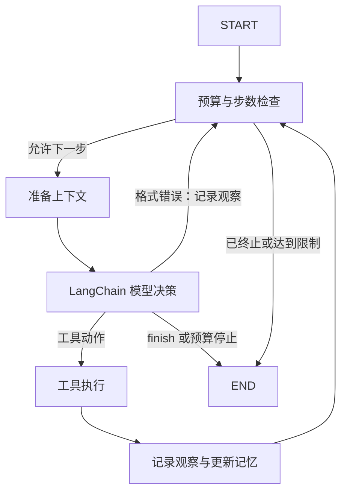

# LangChain / LangGraph Coding Agent 重构设计

状态：用户于 2026-09-15 明确批准“实现”；已进入 TDD 实施，验收证据记录在执行计划和 TASK_STATE。

## 目标与选型

将现有单智能体 ReAct 从手写循环迁移到真实 LangGraph 状态图，使用 LangChain 消息、模型接口与工具 schema 绑定。不是只添加依赖、装饰器或在旧循环外套一个节点。保留自研的工具安全边界、分层记忆与可审计产物。

三种可行方案：

1. **推荐：显式 StateGraph + LangChain 模型适配器**。节点和路由可解释，能保留预算、事件及记忆约束；需要迁移并测试现有 runner。
2. LangChain 高层 create_agent：代码更少，但需通过 middleware 重新建立现有上下文、单动作、事件及终止契约，本项目迁移成本不一定更低。
3. 仅在原 runner 外包装 graph：改动最少，但真正的循环仍为手写，不能支持简历中“状态图编排”的描述，不采用。

本次仍为单智能体 ReAct，不增加 Planner、多 Agent、异步并发、向量库、LangSmith 或跨进程恢复。

## 执行图

`AgentRunner.run(state)` 继续作为对外入口，负责启动记录、图调用、异常处理及统一收尾。图负责完整迭代与条件路由，替换原 `_loop`。`ContextManager`、`ToolRegistry`、`RunEventRecorder` 和 `Finalizer` 保留。

## 状态与生命周期

- 显式图状态携带 run-local RunState、当前 messages、当前 ModelResponse 和 ToolResult 等瞬态字段。运行单线程、无 checkpoint，不将数据库连接/工具对象序列化为可恢复状态。
- 业务节点间明确返回更新，不依赖隐藏的第二份历史或 LangChain 默认 memory。
- 以一次模型决策为一个 agent step，不能把 graph super-step 当作业务 step。递归上限根据每轮最大节点数和 max_steps 计算，作为额外故障保险，不能在业务步数之前意外耗尽。
- 在请求之前检查限制，在报告 usage 后再次检查；达到预算时不得继续执行刚返回的工具动作。
- 格式错误成为 observation 并进入下一步；清理旧 response/result，防止错误后重复执行前一步动作。
- 键盘中断、模型/图异常转为对应终止状态；启动 context 失败也应进入统一收尾。memory finish 失败不得阻止基本运行产物生成，错误需以无敏感内容的诊断记录。
- `Finalizer` 仍是唯一 terminal event 写入者。图节点不额外写 competing AgentFinished/AgentFailed。

## LangChain 模型和工具边界

- 新建 LangChainModelClient，保持当前 ModelClient protocol，ScriptedModelClient 保留供离线测试，但它也必须走相同 LangGraph 执行图。
- DeepSeek 使用 LangChain 官方模型集成；其他 OpenAI-compatible endpoint 使用对应适配器。验证当前 SDK 对自定义 base_url、非思考 extra_body、单次输出 max_tokens 及 tool_choice 的支持，不根据过时示例硬编码模型别名。
- ContextBuilder 输出转为 LangChain 消息；使用 bind_tools 绑定现有六个工具 schema 和 finish schema。严格解析恰好一个 action；多调用、缺调用、非对象参数或 malformed arguments 成为 ModelFormatError。
- 工具定义仍以 ToolRegistry 的 Pydantic 输入 schema 为单一来源，模型绑定不得产生独立维护的 schema。实际执行继续通过 registry，保留路径限制、命令策略、参数校验与结构化错误反馈；不能使用框架自带 shell 工具绕过既有策略。
- LangChain AIMessage 的 usage_metadata/response_metadata 映射到既有 ModelUsage，避免重复累计；cost 不可获得时保持 unknown，不能伪报 0。SDK 的自动重试上限明确配置，预算仍为已报告 token 的停止阈值，不包装成账单硬上限。
- 已有 HTTP 适配器可保留为兼容/测试路径，但 CLI live 默认与项目文档必须真实使用 LangChain 路径，不能只在测试里使用框架。

## 记忆和审计

Working/Episodic Memory、有界确定性摘要、AST Repo Map、SQLite 项目隔离与候选 promotion pipeline 不重写为框架默认 memory。保留 baseline 默认、full opt-in 及无辅助 LLM 调用。

业务事件事实仍由 recorder 生成，history/audit 独立投影。工具一次执行只记录一套事件，correlation_id 保持 step-N。框架 callback 不开启第二套事件日志，不默认联网 tracing。

## 迁移面

- `pyproject.toml`：新增所需 LangChain/LangGraph/provider 集成依赖，选择可兼容 Python 3.12 的版本范围，并记录本地验收版本。
- `agent/runner.py` 及新的 graph 模块：迁移循环，维持 public API。
- `models/` 和 CLI composition：LangChain 适配、provider 选择与实际默认接线。
- tests：保留业务断言，新增 graph 路由、较长步数、启动/收尾异常、多动作拒绝、usage 映射及 mock HTTP DeepSeek payload 回归。
- README、简历介绍、评测协议、TASK_STATE/OpenSpec：同步实际架构，不把本次迁移写成已有记忆设计全部验收完成。

## 验收与约束

1. read/edit/test/finish、错误恢复、step/token/cost 限制和中断全走真实 compiled graph。
2. scripted demo 能离线完成，patch/summary/events 契约保持兼容，每次恰好一个 terminal event。
3. LangChain provider 通过 mock HTTP 验证 endpoint、key、工具、非思考和输出上限，零真实模型调用。
4. 全量 pytest、Ruff lint/format、strict mypy 和 OpenSpec 验证；测试数量以重构后实际输出为准，不预写 131。
5. 不执行真实模型评测、不产生 API 费用；不提交/推送已有未提交更改；新增依赖安装仅用于开发与离线验证。

## 参考

- https://docs.langchain.com/oss/python/langgraph/graph-api
- https://docs.langchain.com/oss/python/integrations/chat/deepseek
- https://api-docs.deepseek.com/api/create-chat-completion/

已自审：无占位节点，不存在第二份事件事实来源；agent step 与 graph step 分开；checkpoint/resumption 明确不在范围；没有承诺未经测量的模型效果。
