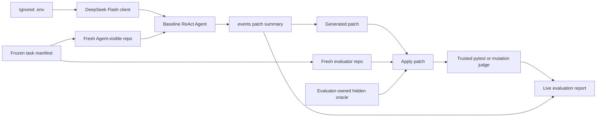

# Live DeepSeek Evaluation Design

## Purpose

Build and run a low-cost, reproducible evaluation of the Coding Agent with the real DeepSeek Flash API. The evaluation must distinguish autonomous model behavior from scripted runtime tests and must judge patches with evaluator-owned tests that the Agent cannot inspect or modify.

The paid stage runs a frozen suite of 12 Python microtasks once each. It first runs `off-by-one` as a connectivity canary. Authentication, transport or evaluator-infrastructure failure stops the suite; an ordinary Agent task failure does not, so unsuccessful samples cannot be silently excluded.

## Scope

Included:

- loading `DEEPSEEK_API_KEY` from the ignored repository-root `.env` file without logging it;
- running 12 real `deepseek-flash` baseline tasks in non-thinking mode;
- capturing the Agent events, patch, summary, usage, latency and termination status;
- applying the generated patch to a fresh evaluator-controlled repository;
- injecting evaluator-owned hidden tests only after the Agent run;
- reporting protocol completion and trusted-oracle correctness separately;
- aggregating the full frozen suite without cherry-picking successful tasks.

Excluded:

- claiming general Coding Agent capability from one or three microtasks;
- enabling LLM condenser or memory-candidate extraction;
- running `full` preset or baseline/full ablation in this suite;
- repeated stochastic trials, SWE-bench or production repositories;
- cross-process Run resumption;
- automatic whole-suite retries or reruns selected to improve the score.

## Evaluation Approaches Considered

### Existing visible-fixture oracle

This is the cheapest option but is not trustworthy. The Agent can inspect or modify the same tests later used for scoring, and the current fixture runner judges the mutated working repository directly.

### Fresh-copy hidden oracle

This is the selected approach. The Agent only receives the declared setup files. After the run, the evaluator exports the patch, prepares a new copy from the frozen setup, applies the patch and then installs hidden tests from outside the Agent-visible repository. This adds modest implementation work but establishes a defensible scoring boundary.

### Immediate baseline/full ablation

This would double the paid runs and mix runtime validation with memory-effect claims before the basic live path is known to work. It remains a later evaluation stage.

## Architecture



The Agent runtime remains unchanged. A live evaluation coordinator owns task selection, client construction, fresh repositories, patch transfer, hidden-oracle installation and report generation. Hidden-oracle files live in the Coding Agent project but outside every generated task repository, so the Agent's confined file tools cannot read them.

## Components

### Environment loader

Use `python-dotenv` to load only the repository-root `.env` file. An already-defined process environment variable takes precedence. The loader returns a `SecretStr` through the existing `RunConfig` boundary. Logs and reports must contain only presence or provider metadata, never the key or a key prefix.

The tracked `.env.example` contains an empty `DEEPSEEK_API_KEY=` entry. The real `.env` remains ignored.

### Live evaluation coordinator

Add a module runnable as:

```powershell
python -m coding_agent.evaluation.live --suite resume-v1 --confirm-paid-run
```

Paid execution requires both an available key and the explicit `--confirm-paid-run` flag. Defaults are fixed for this suite:

- provider: `deepseek`;
- model: `deepseek-flash`;
- base URL: `https://api.deepseek.com`;
- thinking: disabled;
- memory preset: `baseline`;
- maximum model decisions: 8;
- maximum output tokens per request: 512;
- reported total-token stop threshold: 8000;
- auxiliary model calls: 0;
- task suite: the frozen 12-task `resume-v1` suite;
- task repetitions: 1.

The command runs `off-by-one` first as a canary. If model authentication, network transport, patch infrastructure or report infrastructure fails, it stops before later tasks. If the Agent simply produces an incorrect patch or fails to finish the task, that result is retained and the suite continues. The command does not silently retry an entire failed Run. The existing SDK-level `max_retries=1` remains visible in the report metadata.

## Frozen Task Suite

The suite contains 12 small Python tasks, grouped before execution so the report cannot be shaped around observed outcomes.

| ID | Category | Task behavior judged externally |
|---|---|---|
| `off-by-one` | bug fix | return exactly `n` integers across boundary values |
| `change-contract` | API change | uppercase the complete name while preserving the greeting contract |
| `add-regression-test` | test authoring | add a test that kills an evaluator-owned multiply mutation |
| `empty-mean` | error handling | raise the specified exception for empty input without breaking normal means |
| `parse-port` | validation | accept valid integer ports and reject booleans, text and out-of-range values |
| `normalize-tags` | transformation | trim, lowercase and deduplicate tags while preserving first occurrence order |
| `category-totals` | aggregation | sum repeated categories and handle empty input correctly |
| `optional-display-name` | boundary behavior | use the documented fallback only for missing or blank names |
| `json-omit-none` | serialization | recursively preserve valid values while omitting optional `None` fields required by the contract |
| `stable-priority` | ordering | sort by priority while preserving input order for ties |
| `package-export` | multi-file change | implement a package utility and expose it from the public package API |
| `recover-failing-test` | iterative repair | diagnose an initially failing visible test and make the smallest compatible implementation fix |

Every task has frozen setup files, a task prompt, evaluator-owned hidden checks and a manifest hash. Gold implementations are used only to validate the oracle before paid execution and are never placed in an Agent-visible repository or prompt.

### Patch transfer

The evaluator must not run the trusted oracle in the Agent-mutated repository. It creates a new repository from the same frozen `setup_files`, then applies the generated unified diff with Git. Patch application failure is recorded as a failed result without falling back to copying the Agent workspace.

The evaluator records:

- patch existence and SHA-256;
- patch application result;
- changed paths;
- whether the Agent reached `completed`;
- trusted-oracle result.

### Hidden oracle

Hidden tests are copied into the judge repository only after patch application.

`off-by-one` checks `values(0)`, `values(1)` and `values(5)` in addition to the visible example. It rejects hard-coding that only satisfies `n=3`.

`change-contract` checks multiple names, mixed case and the empty string. It verifies that the entire name is uppercased while the `Hello ` prefix remains unchanged.

`add-regression-test` uses mutation scoring rather than accepting any new test file. The evaluator first requires all submitted tests to pass against the correct implementation. It then changes `multiply(a, b)` to an incorrect additive implementation and requires at least one submitted test to fail. The mutation occurs only in the judge repository after the Agent run.

Oracle subprocesses have a 120-second timeout, captured stdout/stderr and no access to the API key in their environment.

## Result Semantics

Report the following separately:

- `protocol_completed`: the Agent emitted a valid finish action;
- `patch_applied`: the generated patch applied to a fresh fixture;
- `trusted_oracle_passed`: the evaluator-owned judge passed;
- `task_success`: all three fields above are true;
- `visible_test_result`: latest test result observed during the Agent run, if any;
- `agent_status` and termination reason;
- steps, tool counts, elapsed time and reported input/output tokens;
- auxiliary tokens, which must remain zero in this stage;
- API cost as `unknown` unless directly supported by trustworthy billing data.

The report includes `evaluation_kind=live_model_microtask_suite`, model, provider, task-manifest hash, evaluator version, limits and timestamp. It labels the sample size explicitly and must not present the result as general autonomous coding performance.

The other nine tasks each include multiple normal and boundary cases derived from their frozen contract. `package-export` imports exclusively through the public package namespace. `recover-failing-test` retains the original evaluator-controlled test in the fresh judge copy. Oracles must first pass against their gold implementation and fail against the initial defective implementation before the paid suite can start.

## Budget and Stop Rules

The authorized suite monetary ceiling is CNY 15.00. This is an operator authorization, not a programmatically guaranteed billing cap. Expected Flash usage for these microtasks is substantially lower, but the report uses observed tokens rather than presenting a pre-run estimate as actual cost.

The coordinator starts with one `off-by-one` canary Run. Authentication, transport or evaluator-infrastructure failure stops the suite. A task-level format exhaustion, step limit, incorrect patch or hidden-oracle failure is recorded and the coordinator advances to the next frozen task. A Run is never retried in full.

The runtime checks reported token usage after responses, so the final response can exceed the 8000-token threshold. SDK retry behavior and failed-response billing may also exceed locally visible usage. The report states these limitations. Account balance or provider-side limits remain the only hard billing boundary.

Before the paid call, run all offline tests for the evaluator and validate every hidden oracle with its initial and gold versions. After the suite, do not automatically rerun tasks to improve the result.

## Failure Handling

- Missing or empty `.env` key: fail before constructing the live client.
- Key appears in an event, report or exception rendering: fail the sanitization test and do not run paid evaluation.
- Transport/authentication error: record a transport failure without exposing provider response secrets; do not retry the whole Run.
- Agent format error: retain the existing in-Run correction path and count the model decision.
- Patch missing or not applicable: record the exact stage and skip oracle execution.
- Hidden oracle timeout: record `oracle_timeout`; do not classify it as a successful patch.
- Report-writing failure: preserve the original Agent artifacts and surface the error.

## Files and Data Ownership

Expected implementation areas:

- `pyproject.toml`: add `python-dotenv` dependency;
- `.env.example`: tracked empty configuration template;
- `src/coding_agent/evaluation/live.py`: paid-run gate and coordinator;
- `src/coding_agent/evaluation/trusted_oracle.py`: fresh-copy patch and hidden judging;
- `tests/fixtures/hidden_oracles/`: evaluator-owned oracle sources, never copied into Agent repos;
- `tests/unit/evaluation/`: environment, patch, oracle and report tests;
- `docs/EVALUATION.md`: exact command, limitations and interpretation;
- `benchmarks/`: sanitized suite result only after the paid run succeeds or fails conclusively.

Generated Agent workspaces and raw artifacts remain under ignored `runs/`. The sanitized benchmark report may be tracked after manual inspection. No `.env` content is copied into fixtures, artifacts or reports.

## Verification

Offline verification must cover:

- `.env` loading with process-environment precedence;
- paid-run confirmation required before model construction;
- key absent from exceptions, artifacts and report serialization;
- hidden files absent from Agent-visible repositories;
- clean-copy patch application;
- each functional hidden oracle rejecting a hard-coded or incomplete patch;
- mutation oracle accepting a meaningful regression test and rejecting a vacuous test;
- patch-application and oracle-timeout failure reports;
- canary infrastructure failures stop the suite while ordinary task failures remain in the denominator;
- no whole-Run retry or selective result replacement;
- existing full pytest, Ruff, format, mypy and OpenSpec checks.

The paid acceptance run is exactly one pass over the frozen 12-task suite. Its result is reported as a 12-task microtask evaluation, regardless of outcome.

## Follow-up Gate

After the 12-task report, stop and request review. Any repeat, replacement task, `full` preset or baseline/full comparison requires a new explicit approval based on the observed traces and usage.
