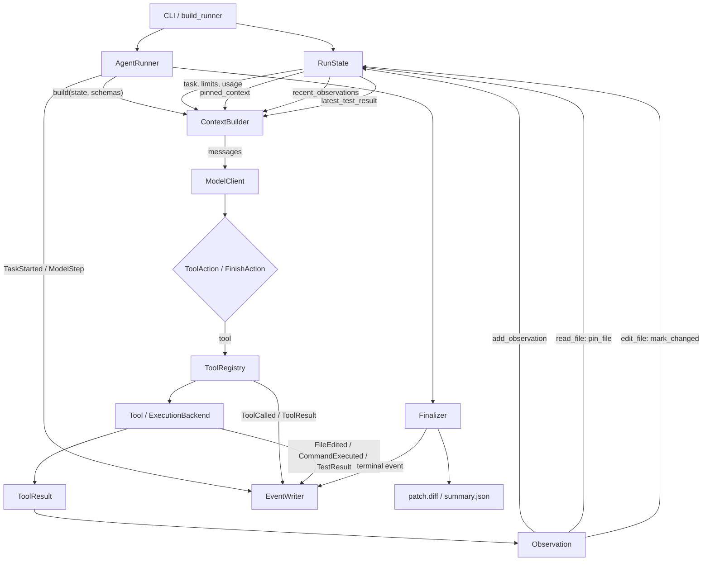
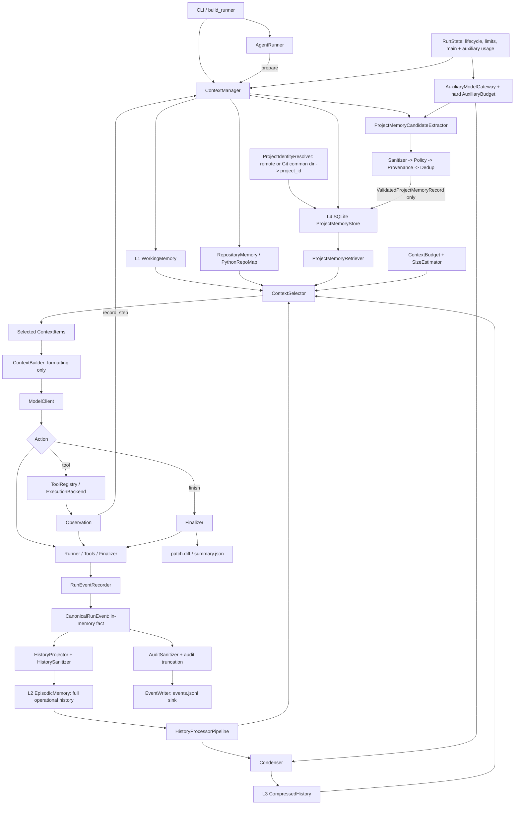

## Context

V1 composes `RunState`, `ContextBuilder`, `ModelClient`, `ToolRegistry`, `EventWriter`, and `Finalizer` in `build_runner`. For each step, the runner asks `ContextBuilder` to directly inspect mutable state, formats tool schemas into a system message, calls the model, executes one tool, converts its result to an `Observation`, and mutates context-related fields on `RunState`.

The current design is intentionally a baseline. It has no semantic ranking, historical summarization, repository-level structural memory, or cross-run project memory. This change promotes context handling into a subsystem while preserving the understandable synchronous ReAct loop.

### OpenSpec dependency

`add-hierarchical-context-memory` is not a parallel alternative to `build-coding-agent-mvp`; it is a dependent architecture increment over that completed implementation and acceptance baseline. Following explicit approval, the prerequisite was archived as `2026-09-14-build-coding-agent-mvp`, creating the main `agent-run`, `baseline-evaluation`, `run-artifacts`, and `workspace-tools` specs.

The required lifecycle order is:

```text
validate completed build-coding-agent-mvp
-> archive as 2026-09-14-build-coding-agent-mvp
-> reconcile this change as deltas over the main specs
-> strict validation
-> writing-plans
-> TDD implementation
```

The prerequisite archive and reconciliation are complete. This change now contains formal modified deltas for affected V1 capabilities and cannot weaken their unaffected requirements.

### Current data flow



### Current limitations

1. `ContextBuilder.build()` owns selection, LRU eviction, observation filtering, section priority, budget enforcement, JSON serialization, and message formatting.
2. `RunState` mixes lifecycle control with context payloads. Its bounded observation deque silently loses older history; it is neither full episodic memory nor only control state.
3. Model-visible history contains tool observations but not a complete correlated action/observation trajectory. Audit events include tool calls and results, but they lack a stable per-action correlation identifier and are not exposed as a context view.
4. Large outputs are only dropped or truncated. No structured summary preserves discoveries, failed attempts, edits, verification, and remaining work.
5. Character budgeting counts only message content. It does not account for out-of-band tool schemas, message framing, or response reserve, and section limits are embedded in the builder.
6. A large task, latest test, or tool schema set can make mandatory context exceed the runtime limit and fail the run instead of being validated or degraded predictably.
7. Pinned files are full-content, read-recency-only entries. Changed files, current progress, errors, and diff summaries are not first-class working-memory items.
8. There is no repository symbol view, cross-run store, memory provenance, retrieval score, or component-level ablation metric.
9. Audit payload sanitization/truncation and model-context transformation have different goals but no explicit adapter boundary.

## Goals / Non-Goals

**Goals:**

- Distinguish L1 working, L2 episodic, L3 compressed, and L4 persistent project memory.
- Preserve the current synchronous one-action-per-step ReAct loop and current safety boundaries.
- Make history transformation, condensation, retrieval, selection, estimation, and formatting independently testable.
- Keep a single canonical in-memory event fact while deriving model-facing history before audit-specific truncation and independently writing sanitized audit JSONL.
- Guarantee that selected context fits a declared estimate budget and cannot be displaced by a single large optional item.
- Support deterministic component toggles and evaluation ablations.
- Ensure auxiliary model calls have explicit hard limits and participate in total run accounting.

**Non-Goals:**

- Event-sourced run recovery, cross-process run resumption, process crash rehydration, or reconstructing `RunState` from JSONL.
- General personal memory, user profiling, autonomous long-term goal management, or sharing memory across unrelated repositories.
- Vector databases, embeddings in the first implementation, graph PageRank, tree-sitter, non-Python Repo Maps, or framework-sized orchestration.
- Changing the six-tool surface, edit semantics, command policy, execution backend, model API, or finalizer ownership.
- Treating model-generated summaries as correctness evidence.

## Considered Approaches

### Approach A: Incremental `ContextManager` with typed memory components — recommended

Keep `RunState` as lifecycle/control state. Add `ContextManager` as the facade used by the runner, with small in-memory collaborators and a SQLite project-memory collaborator. Runtime facts are captured once as canonical in-memory events; independent audit and history projections derive from those events. `ContextBuilder` only formats selected items.

**Benefits:** preserves V1 boundaries, enables isolated tests and ablations, and avoids rewriting the loop. Each new abstraction corresponds to a requested variability point. **Costs:** introduces several focused modules and requires an additive migration of event payloads and runner composition.

### Approach B: Make the audit event log the event-sourced runtime state

Persist every action and observation, rebuild state and context from the log, and derive `RunState` as a reducer projection.

**Benefits:** one durable source can eventually support replay and recovery. **Costs:** substantially changes V1 semantics, makes artifact I/O part of the hot path, couples context to sanitized/truncated audit data, and introduces recovery/versioning work that is outside scope. This is rejected for V2.

### Approach C: Put all four memory levels in SQLite

Store working, episodic, compressed, repository, and persistent memory in normalized tables and query them for every model step.

**Benefits:** uniform persistence and querying. **Costs:** unnecessary latency and schema complexity for run-local state, unclear transaction ownership, and tight coupling between model context and storage. This is rejected; only L4 is durable by default.

## Decisions

### 1. Preserve existing module roles and add one facade

The following roles remain:

- `AgentRunner`: owns loop order, terminal-state selection, and model/tool orchestration.
- `ToolRegistry` and six tools: validate and execute deterministic actions.
- `ModelClient`: performs one structured model completion.
- `ExecutionBackend`: executes allowed commands.
- `EventWriter`: writes sanitized, append-only audit events.
- `Finalizer`: remains the sole terminal-event and final-artifact owner.
- `actions.py`: retains action, observation, and usage value types.

The following responsibilities move:

- Context payloads move out of `RunState` into `WorkingMemory` and `EpisodicMemory`.
- Selection, ranking, section allocation, and pruning move out of `ContextBuilder` into `ContextSelector` and `ContextBudget`.
- History filtering and compression move into `HistoryProcessorPipeline` and `Condenser`.
- Repository structure and cross-run knowledge get dedicated owners.
- `ContextManager` coordinates these collaborators and exposes a small runner-facing API.

Proposed runner-facing contract:

```text
ContextManager.start_run(state) -> None
ContextManager.prepare(state, tool_schemas) -> PreparedContext
ContextManager.record_step(step, action, observation | None) -> None
ContextManager.finish_run(state) -> MemoryRunReport
```

`record_step` is bookkeeping, not policy in the runner. Internally it updates working memory, receives canonical events, invalidates changed Repo Map entries, and considers condensation.

### 2. Restrict `RunState` to control and final-result facts

`RunState` retains:

```text
run_id, repo_root, project_id, task, base_commit
limits, effective_config, status, step_count
main_model_usage, auxiliary_model_usage, combined usage properties
started_at, finished_at, termination_reason, finish_summary
tool_counts and final changed-file summary needed by artifacts/evaluation
```

`RunState` no longer owns:

```text
recent_observations, pinned_context, latest_test_result
current plan/progress, recent errors, diff summary
raw event history, condensed summaries, Repo Map, project-memory records
```

Those values have distinct lifecycle and selection rules. `RunState` may expose immutable identifiers or final metric snapshots, but not mutable memory collections.

### 3. Use four explicit memory levels

#### L1 `WorkingMemory`

Run-local, high-priority state for the next decision: task reference, plan/progress, pinned file excerpts, changed files, latest test, current diff summary, recent errors, remaining steps, and model-budget status. Pinned entries are keyed by path plus line range/content revision, bounded at write time, and refreshed after edits. Working memory is never persisted as a whole.

#### L2 `EpisodicMemory`

An append-only run-local sequence of correlated action, tool, result, error, test, and decision entries. It retains history-sanitized projections of producer-bounded canonical payloads, which may be richer than the stricter audit projection, even when only a transformed view is sent to the model. Action/result pairs are atomic for processing and condensation.

#### L3 `CompressedHistory`

Run-local structured `CondensedSummary` snapshots covering non-overlapping historical sequence ranges. A summary coexists with a raw recent tail. It is stored by `EpisodicMemory` (or a focused child object owned by it), not in `RunState` and not automatically in project memory.

#### L4 `PersistentProjectMemory`

Cross-run, project-scoped typed facts stored in SQLite. Retrieval returns candidates; it does not inject the entire store. The store is independent of `RunState` and the run artifact directory contents.

### 4. Keep one canonical in-memory event fact with two ordered projections

Introduce a small `RunEventRecorder`, not a general event bus. Its order is normative:

```text
emitter
  -> RunEventRecorder.record(type, operational_payload, correlation_id)
  -> CanonicalRunEvent in memory
       |-> HistoryProjector
       |     -> HistorySanitizer
       |     -> HistoryEvent
       |     -> EpisodicMemory
       |
       `-> AuditSanitizer
             -> audit-specific hard truncation
             -> AuditRunEvent
             -> EventWriter
             -> events.jsonl
```

`CanonicalRunEvent` is the single event fact. The recorder assigns `run_id`, monotonic `sequence`, UTC timestamp, event type, and `correlation_id` once. Its operational payload is already bounded by the producing boundary, such as `read_file.max_chars` or `run_command.output_limit_bytes`, but is not reduced to the stricter audit-log string limit. It lives only for the current process and is never serialized directly.

The history path consumes `CanonicalRunEvent`, not `AuditRunEvent`. `HistoryProjector` drops audit-only fields/events and converts relevant facts into non-durable `HistoryEvent` values. `HistorySanitizer` redacts registered secrets and unsafe fields before append to `EpisodicMemory`; later history processors perform model-context truncation. This preserves more useful output than the audit copy without allowing secrets into model-facing memory.

The audit path independently applies `AuditSanitizer`, redaction, and the existing strict per-string limit, then hands an `AuditRunEvent` to `EventWriter`. `EventWriter` is only an append-only JSONL sink: it does not create canonical events, project history, or feed episodic memory. Existing schema-1 readers continue to accept additive correlation fields.

`HistoryEvent` and `AuditRunEvent` both carry `source_sequence`/the canonical sequence, but neither can be independently emitted as a second fact. Audit-only events may project to no history entry. All events produced by one model action use `correlation_id = "<run_id>:step:<step_count>"`; run-level events use no correlation. Processors and condensers treat each non-null correlation group atomically.

Terminal emission still belongs to `Finalizer`. It invokes the recorder's restricted terminal path, which produces the canonical terminal event and audit projection exactly once; terminal events need not enter model-facing episodic memory after the run is terminal.

### 5. Process a copy-on-write context view

`HistoryProcessor` has one deterministic contract:

```text
process(HistoryView, ProcessingContext) -> HistoryView
```

Processors never mutate raw episodic history. The initial pipeline is ordered:

1. `DeduplicateProcessor`: collapses repeated equivalent low-value observations while retaining counts and newest provenance.
2. `LargeOutputProcessor`: replaces oversized stdout, stderr, search, and file payloads with bounded head/tail plus truncation metadata.
3. `TestResultProcessor`: retains the latest verification result and compactly represents older results.
4. `RecentObservationProcessor`: preserves the raw recent tail and marks the older stable prefix as condensation-eligible.
5. `SummaryProcessor`: places the latest applicable condensed summary before the raw tail and removes raw events already covered by it from the visible view.

Pipeline order is configuration, validated at composition time. Processors operate on atomic correlation groups so a tool call cannot be retained without its corresponding outcome.

### 6. Trigger condensation by projected pressure, not every step

`Condenser` implementations are `NoOpCondenser`, `SlidingWindowCondenser`, and `LLMSummarizingCondenser`. Condensation runs before final selection only when all of these are true:

- the processed history estimate exceeds a configured high-water mark for the history allocation, or a provider context-limit error requests a hard condensation;
- a stable prefix exists outside the protected recent tail and outside any incomplete action/result group;
- the eligible prefix has grown by at least `min_new_events` since the last successful attempt;
- the condenser cooldown and per-run call limit permit another auxiliary call.

A soft trigger may leave history unchanged when no safe prefix exists. A hard trigger first requests an LLM summary if configured, then falls back to the deterministic sliding window. Expected condenser failures never fail the agent run.

Each attempt records whether condensation occurred, covered sequence range, event count, input/output estimate, model usage/cost when reported, failure category, and fallback used. LLM summaries must follow a structured schema preserving files/modules inspected, facts, hypotheses, attempts, failed approaches and reasons, edits, tests, remaining work, and avoid-repeat guidance.

#### Auxiliary model budget

LLM condensation and optional LLM candidate extraction are auxiliary model calls. They use an `AuxiliaryModelGateway` that is the only allowed path for such calls. Usage accounting distinguishes main and auxiliary work but applies both to the same run-wide hard limits:

```text
RunUsage
  main_model: ModelUsage
  auxiliary_model: ModelUsage
  total_tokens = main_model.total_tokens + auxiliary_model.total_tokens
  total_cost_usd = sum(all call costs), or unavailable if any call cost is unknown

AuxiliaryBudget
  max_calls: int
  max_tokens: int
  max_cost_usd: float | None
  per_component_call_limits: condenser / candidate_extractor
```

An auxiliary call may start only when a conservative input estimate fits both the remaining global `RunLimits` and the remaining `AuxiliaryBudget`. Its reported usage is committed to both the auxiliary breakdown and global totals immediately after the response, including failed structured-output parsing when the provider reports usage. Reaching either hard limit prevents further auxiliary calls. If a condenser call is denied, the deterministic sliding-window fallback runs; if candidate extraction is denied, optional LLM extraction is skipped and deterministic candidates continue.

Token limits remain enforceable when cost metadata is absent. Unknown cost is never treated as zero. If either global or auxiliary cost limits are configured, every enabled main and auxiliary model client must report cost or have deterministic pricing metadata; otherwise composition fails before the run. Without a cost limit, unknown aggregate cost is reported as unavailable while tokens and call limits remain hard. Auxiliary usage appears separately and in total run usage in events, summaries, and evaluation.

### 7. Store condensed summaries with provenance and replacement rules

```text
CondensedSummary
  summary_id: str
  run_id: str
  revision: int
  covered_from_sequence: int
  covered_through_sequence: int
  content: StructuredSummary
  source_event_count: int
  created_at: UTC datetime
  condenser: str
  usage: ModelUsage | None
  fallback_reason: str | None
```

Summaries cover contiguous, non-overlapping prefixes. A later roll-up may replace older summary revisions only after it covers the same range plus more events. Raw episodic events remain available for run inspection; only the model-visible `HistoryView` substitutes the summary for the covered prefix.

### 8. Build a lightweight Python repository memory

At run startup, `PythonRepoMap` scans confined, Git-visible `.py` files, parses them with `ast`, and indexes imports, classes, functions, methods, parents, and signatures. Syntax/read failures become diagnostics and do not abort the run. No source code is executed.

```text
RepoSymbol
  path: str
  qualified_name: str
  kind: module | class | function | method
  signature: str | None
  parent: str | None
  imports: tuple[str, ...]
  line: int
  content_hash: str
```

After a successful file edit, the path is invalidated and reparsed before the next context preparation. A new Python file is added; an unparseable or removed file has its stale symbols removed and emits a diagnostic. A full rescan occurs only at run start or explicit refresh. Selection uses deterministic lexical overlap with task terms, mentioned symbols/paths, pinned and changed paths, import adjacency, and recency. Already-pinned full files are down-ranked to avoid duplication. Repo Map context has its own hard section cap.

### 9. Persist only curated project knowledge in SQLite

The database lives under the external artifact root, not inside the target repository. Every record includes a stable versioned project identifier so an explicit shared artifact root can safely hold multiple repositories.

#### Stable `project_id`

`ProjectIdentityResolver` computes:

```text
project_id = "sha256:" + sha256("coding-agent-project-v1\0" + identity_key).hexdigest()
```

The identity key is selected deterministically:

1. If `remote.origin.url` exists, use `remote:` plus its sanitized canonical remote identity. Canonicalization removes credentials, query, fragment, trailing slash, and a terminal `.git`; lowercases scheme and host; retains host port and repository-path case; normalizes path separators; and maps SCP-style `user@host:org/repo.git` to the equivalent SSH host/path identity without the username. Separate clones and linked worktrees for that canonical remote therefore share project memory.
2. If no origin remote exists, use `local:` plus the absolute, symlink-resolved `git rev-parse --git-common-dir` path, processed with `os.path.normcase` and `/` separators. Repeated runs and linked worktrees from the same local Git common directory share memory. Different local repositories remain isolated. Moving a no-remote repository intentionally creates a new identity unless a future explicit identity override is introduced.

The raw remote URL and local common-directory path are used only to calculate the hash and are not stored in project-memory records or emitted to model context. Failure to resolve a Git identity prevents L4 initialization but does not fail the agent run.

```text
ProjectMemoryRecord
  memory_id: str
  project_id: str
  type: architecture | convention | important_module | testing |
        known_failure | past_attempt | decision | useful_command | run_summary
  content: str
  normalized_hash: str
  importance: float
  confidence: float
  source_run_id: str
  source_event_sequences: tuple[int, ...]
  related_paths: tuple[str, ...]
  created_at: UTC datetime
  last_confirmed_at: UTC datetime
  access_count: int
  status: active | superseded
```

#### Candidate extraction and promotion boundary

`ProjectMemoryCandidateExtractor` has no store dependency:

```text
extract(ProjectMemoryExtractionInput, AuxiliaryCallContext)
  -> list[ProjectMemoryCandidate]

ProjectMemoryCandidate
  candidate_id: str
  type: ProjectMemoryType
  content: str
  importance: float
  confidence: float
  source_run_id: str
  source_event_sequences: tuple[int, ...]
  related_paths: tuple[str, ...]
  extraction_method: deterministic | llm_structured
```

Initial implementations are:

- `NoOpProjectMemoryCandidateExtractor` for disabled project memory.
- `DeterministicProjectMemoryCandidateExtractor`, which produces compact run summaries and evidence-derived candidates from typed final state, verification results, changed paths, Repo Map facts, and explicitly structured decisions. It does not infer facts from arbitrary prose.
- Optional `LLMStructuredProjectMemoryCandidateExtractor`, which receives a bounded source view through `AuxiliaryModelGateway` and must return the candidate schema with cited source event sequences. It cannot access `ProjectMemoryStore` and cannot mark its own output as validated.

All extractor output follows one mandatory promotion pipeline:

```text
ProjectMemoryCandidateExtractor
  -> CandidateSanitizer
  -> ProjectMemoryPolicy
  -> ProvenanceValidator
  -> CandidateNormalizer
  -> ProjectMemoryDeduplicator
  -> ValidatedProjectMemoryRecord
  -> ProjectMemoryStore.upsert_validated(...)
```

The store API accepts `ValidatedProjectMemoryRecord`, not raw candidates or strings. `CandidateSanitizer` removes registered secrets, unsafe metadata, and disallowed absolute paths and enforces field-size limits. `ProjectMemoryPolicy` applies the type allowlist, evidence/confidence thresholds, project scope, and transient-data exclusions. `ProvenanceValidator` verifies the run ID, every cited canonical event sequence, and every related path against the current run/repository. Normalization and deduplication occur before persistence; a store uniqueness constraint is the final race-safety backstop. LLM output can therefore propose but never directly persist memory.

Allowed records must be bounded, sanitized, repository-scoped, typed, and provenance-linked. Raw command output, file contents, API data, credentials, transient errors, unsupported model claims, and personal information are not promoted. Deterministic extraction is always available when L4 is enabled. LLM structured extraction is opt-in, auxiliary-budgeted, and skipped on failure or budget denial without blocking deterministic promotion.

Deduplication uses `(project_id, type, normalized_hash)`. Reconfirmation updates provenance and recency instead of inserting a duplicate. Per-type and global limits evict or supersede lowest-value stale records, never the newest copy of an active decision. SQLite FTS5 is used when available; deterministic token/`LIKE` fallback keeps Windows builds functional without an extension dependency.

Retrieval applies a transparent hybrid score:

```text
keyword/FTS relevance
+ related-path overlap
+ type prior and stored importance
+ bounded recency contribution
+ confirmation contribution
```

The retriever interface accepts a future semantic scorer, but no embedding is computed in this change.

### 10. Select context in two budgeted phases

Every candidate is a `ContextItem`:

```text
ContextItem
  item_id: str
  type: ContextItemType
  content: str
  priority: mandatory | high | normal | low
  estimated_size: int
  source: ContextSource
  relevance: float
  importance: float
  recency: float
  atomic_group: str | None
  metadata: dict[str, JsonValue]
```

`ContextBudget` owns a total input allowance, response reserve, framing/tool-schema estimate, mandatory reserve, and per-section minimum/maximum allocations for working memory, pinned code, Repo Map, recent history, compressed history, and persistent memory.

Selection is deterministic for equal inputs:

1. Estimate fixed overhead, tool schemas, response reserve, task, and mandatory working items.
2. Reject an impossible configuration before the first model call if immutable task plus minimum overhead cannot fit. Bounded fields such as test output degrade to a compact representation; the task is not silently truncated.
3. Include mandatory items and atomic groups first.
4. Rank optional items by priority, relevance, importance, and recency with stable source/id tie-breakers.
5. Fill each section up to its cap; transfer unused optional allocation through a configured spill order, never by stealing mandatory reserve.
6. Re-estimate the formatted package. If it exceeds the limit, remove the lowest-ranked optional atomic group until it fits.

The initial `SizeEstimator` uses conservative character units and explicit overhead. A tokenizer-backed implementation can replace it without changing selectors or builders. The guarantee is against the configured estimator; provider context-limit rejection causes one hard-condensation/reselection recovery path rather than an unbounded retry loop.

### 11. Make `ContextBuilder` a formatter

`ContextBuilder.build(prepared_context)` renders ordered `ContextItem` values into `Message` objects and adds explicit omission/diagnostic markers already selected by the manager. It does not query stores, score relevance, condense history, evict files, or allocate budgets. Tool schemas are passed to `ModelClient` through its existing tool parameter and are budgeted as overhead; they are not redundantly serialized into message content unless a provider adapter explicitly requires it.

### 12. Keep the ReAct loop small

The runner's step remains:

```text
check run limits
-> begin step
-> context_manager.prepare(state, tool_schemas)
-> model.complete(messages, tool_schemas)
-> action
-> tool execution when applicable
-> recorder/context_manager record outcome
-> next step
```

The runner does not choose processors, calculate scores, access SQLite, parse AST, or decide condensation policy. `build_runner` composes those policies from validated configuration.

## Target Architecture



## Complete Step Data Flow

1. Runner checks step/token/cost limits and calls `state.begin_step()`.
2. `ContextManager.prepare` refreshes invalid Repo Map paths and snapshots working memory.
3. Episodic memory creates a read-only raw `HistoryView`; the processor pipeline produces a bounded context-visible view.
4. If projected history crosses the trigger threshold and both global and auxiliary budgets admit a call, the condenser compresses only the safe old prefix through `AuxiliaryModelGateway`. Budget denial or failure records diagnostics and uses sliding-window fallback.
5. The manager retrieves task/path-relevant project records and Repo Map symbols.
6. All sources emit typed `ContextItem` candidates. `ContextSelector` applies mandatory rules, section caps, scores, atomic grouping, and spill policy under `ContextBudget`.
7. `ContextBuilder` formats the selected package. The manager records per-section estimated size and omissions for evaluation.
8. `ModelClient.complete` returns one action. The recorder creates one correlated canonical `ModelStep`/action event. History projection reads that in-memory event before the independent audit sanitizer creates the stricter JSONL copy.
9. For a tool action, `ToolRegistry` executes once. Its call/result/domain facts become canonical events with the same correlation ID; independent history and audit projections derive from each event. The runner converts the result to `Observation` as today.
10. `ContextManager.record_step` updates working memory, latest test/errors, changed paths, pinned excerpts, and Repo Map invalidations. It does not call the model.
11. A finish action or terminal condition follows the existing one-shot finalizer path. The candidate extractor proposes deterministic and, when configured and budget-admitted, LLM-structured candidates. The mandatory sanitizer/policy/provenance/dedup pipeline produces the only values accepted by the store. The manager returns memory metrics before `Finalizer` writes the final summary.

## Memory Lifecycle

```text
build_runner:
  resolve versioned project_id -> open store -> build Repo Map
  -> create run-local memories and main/auxiliary usage ledgers

start_run:
  seed WorkingMemory -> retrieve L4 candidates -> record TaskStarted

each step:
  refresh invalid repo entries -> process L2 -> maybe update L3
  -> select/format context -> act -> append canonical events
  -> update L1 and Repo Map invalidations

finish_run:
  freeze run-local memories -> emit metrics/condensation diagnostics
  -> extract L4 candidates -> sanitize/policy/provenance/dedup
  -> persist validated records only -> close store handle
  -> existing Finalizer writes terminal artifacts

next run:
  create new L1/L2/L3 -> reuse L4 by project_id -> rebuild/refresh Repo Map
```

L1, L2, and L3 live for one process-bound run. L2 operational history is richer than the audit projection and is not reconstructed from JSONL or restored into a new process. Cross-process run resumption is explicitly out of scope. L4 is queried, not copied wholesale. Repo Map is a rebuildable cache and may optionally persist later, but persistence is not required in the first implementation.

## Configuration and Ablation

`MemoryConfig` contains independent flags for processors, condenser, Repo Map, project memory, and LLM candidate extraction, plus typed sub-configurations, context allocations, and auxiliary hard limits. Presets map to:

```text
baseline: legacy recent observations and pinned files through compatibility adapter
processor: baseline + processor pipeline
condenser: processor + condenser
repo_map: baseline + Python Repo Map
project_memory: baseline + persistent retrieval
full: all components
```

Disabling a component substitutes a no-op implementation at composition time; conditionals are not spread through the runner.

`baseline` remains supported and is the default throughout migration and initial release. `full` is an opt-in evaluation variant. It may become the default only after paired evaluation demonstrates an acceptable quality, cost, latency, and fallback profile and a later explicit design decision changes the default.

## Migration Strategy

1. Confirm the archived `2026-09-14-build-coding-agent-mvp` baseline and resulting main specs remain valid before each major migration checkpoint.
2. Add new value models, context/auxiliary budgets, and pure processors without changing the runner.
3. Wrap current state-derived context as compatibility `ContextItem` producers and prove message parity for the baseline preset.
4. Introduce `ContextManager` and make `ContextBuilder` formatting-only behind the same `build` outcome expected by `ModelClient`.
5. Move pinned files, latest test, and observations from `RunState` to run-local memory after behavior parity tests pass. Keep temporary read-only compatibility properties for one migration slice if tests require them; remove them before completing the change.
6. Add canonical in-memory event recording, separate history/audit projections, and correlation while preserving existing event types and terminal ownership.
7. Add processors, main/auxiliary usage accounting, and condensers, then Repo Map, candidate extraction/promotion, and SQLite project memory as independent vertical slices.
8. Extend evaluation and artifact summaries with additive context and auxiliary metrics. Preserve existing schema-1 fields and old JSONL readability.
9. Keep baseline as the default. Treat any later default switch to full mode as a separate evidence-backed design decision.

No existing `events.jsonl` file is imported into project memory. Existing run artifacts stay immutable. The SQLite schema starts at `PRAGMA user_version = 1`; future incompatible changes use explicit forward migrations and fixtures.

## Error Handling

- Processor failure is a programming/configuration error caught by focused tests; an unexpected runtime processor failure records a diagnostic and uses the last valid view.
- LLM condenser transport/format/context errors or auxiliary-budget denial record `CondensationFailed` and use deterministic sliding-window fallback.
- Repo Map parse/read failures remove stale entries for that file, record diagnostics, and continue without that file.
- Project-memory open/write failure disables L4 for the current run and records a diagnostic; it never blocks agent completion or final artifacts.
- Candidate extraction failure yields no candidates from that extractor; deterministic extraction still runs when enabled. Policy, sanitization, provenance, or dedup rejection is recorded without calling the store.
- Retrieval failure yields no persistent-memory candidates.
- An auxiliary call that cannot fit global or auxiliary hard limits is not made. Reported auxiliary usage is charged before another main or auxiliary call is considered.
- Impossible mandatory context is rejected during run construction; a later provider context rejection allows one hard-condense/reselect attempt, then becomes a normal model failure.
- No fallback may discard the task, active constraints, latest test summary, or incomplete action/result group.

## Testing Strategy

### Unit tests

- `WorkingMemory`: priority, pinned excerpt replacement, changed-file refresh, latest test, errors, and write-time bounds.
- `HistoryProcessorPipeline`: ordering, immutability, deduplication, large-output transformation, test retention, recent tail, and atomic action/result groups.
- `Condenser`: thresholds, safe prefix, structured summary, cooldown/call limit, main-plus-auxiliary usage accounting, budget denial, fallback, and summary range replacement.
- `ContextBudget`: overhead, per-section caps, spill order, mandatory reserve, estimator replacement, and impossible input.
- `ContextSelector`: deterministic ranking, atomic groups, mandatory inclusion, exact estimate cap, and omission metadata.
- `PythonRepoMap`: imports/classes/functions/methods/signatures, syntax errors, deterministic output, lexical/path relevance, and incremental refresh.
- `ProjectIdentityResolver`: equivalent canonical remotes, same-project repeated runs, linked worktrees, different-project isolation, remote credential stripping, and no-remote Git common-directory fallback.
- `ProjectMemoryCandidateExtractor`: deterministic candidates, structured LLM candidates, malformed output, auxiliary-budget denial, and proof that extractors have no store dependency.
- Candidate promotion: sanitization, policy, provenance validation, normalization, deduplication, validated-record typing, and rejection before store access.
- `ProjectMemoryStore`: schema migration, validated-record-only writes, limits, supersession, FTS/fallback retrieval, and project isolation.
- Event adapter: one canonical in-memory event, history projection from the pre-audit payload, independent audit sanitization/truncation, correlation, secret safety, terminal ownership, and no competing persistence.
- `ContextBuilder`: formatting only and stable message output.

### Behavior tests

1. Many observations cross the threshold: old history is condensed, recent raw history remains, and task/latest test remain.
2. LLM condensation fails: sliding-window fallback is used and the run completes.
3. Multiple large file reads: pinned memory stays bounded and changed/current files outrank stale reads.
4. A second run retrieves an architecture or convention record stored for the same project and not for another project.
5. A fixture repository yields correct classes, functions, methods, signatures, and imports; editing one file refreshes only its symbols.
6. A correlated tool call and result are never split by processors, condensation, or selection.
7. Mandatory context too large is rejected before a model call; optional pressure never exceeds the estimator budget.
8. Audit truncates a large tool result more aggressively than history, while model-facing history remains secret-free and processors bound its selected view.
9. Main and auxiliary calls share the global run limit; auxiliary hard-limit denial triggers deterministic fallback or skips LLM extraction without overspending.
10. Repeated runs with one canonical remote share L4, different remotes remain isolated, and a no-remote repository stays stable across runs through its Git common directory.

### Integration and regression tests

- Existing scripted CLI and ReAct behavior remain green under the baseline compatibility preset.
- Existing events, finalizer uniqueness, patch, and summary contracts remain green.
- Full mode works offline with scripted agent and condenser clients and creates/reuses an external SQLite database.
- Optional LLM candidate extraction uses a scripted auxiliary client and can never invoke `ProjectMemoryStore` directly.
- Windows paths, SQLite locking/closing, and AST refresh work without platform-specific dependencies.

## Evaluation Plan

Run the baseline, processor, condenser, Repo Map, project-memory, and full presets over identical deterministic fixtures and later live-model tasks. Record:

```text
task success and independent test success
steps and tool calls
agent model input/output tokens and cost
auxiliary calls and hard-limit denials by component
condenser calls, covered events, auxiliary tokens, cost, failures, and fallbacks
candidate-extractor mode, proposals, validation rejections, auxiliary tokens, and cost
estimated total context and per-section sizes
selected/omitted item counts by source
Repo Map build/refresh time and selected symbols
project-memory query latency, candidates, and selected records
```

Deterministic tests establish correctness, not quality improvement. A later live-model evaluation should report paired results and avoid claiming that memory improves success unless repeated tasks show it.

## Suggested Directory Structure

```text
src/coding_agent/
  agent/
    actions.py
    runner.py
    state.py
  context/
    builder.py          # selected items -> model messages
    manager.py          # runner-facing facade and lifecycle
    items.py            # ContextItem and PreparedContext
    budget.py           # budgets and SizeEstimator
    selector.py         # deterministic ranking/allocation
  memory/
    models.py           # HistoryEvent, views, summaries, project records
    auxiliary.py        # auxiliary gateway, usage ledger, and hard limits
    working.py          # L1 WorkingMemory
    episodic.py         # L2 raw history + L3 summary ownership
    processors.py       # processor protocol and initial pipeline
    condenser.py        # no-op, sliding, and LLM condensers
    candidates.py       # candidate models and extractor protocol/implementations
    promotion.py        # sanitization, policy, provenance, normalization, dedup
    identity.py         # versioned project_id resolution and hashing
    persistent.py       # SQLite schema/store
    retrieval.py        # hybrid project-memory retrieval
  repository/
    symbols.py          # RepoSymbol values
    repomap.py          # AST scan, refresh, render, relevance
  events/
    models.py
    recorder.py         # canonical in-memory emission and correlation
    projections.py      # independent history and audit projections/sanitizers
    writer.py           # append-only AuditRunEvent sink
    artifacts.py
  evaluation/
    runner.py
    baseline.py
```

`index.py` is intentionally omitted until symbol storage and rendering become large enough to justify a third repository module.

## Risks / Trade-offs

- LLM summaries are lossy and can invent facts. Structured provenance, raw-history retention, recent-tail protection, and non-authoritative status reduce but do not eliminate this risk.
- LLM candidate extraction can propose unsupported project facts. The validated-record-only store API and mandatory sanitization/policy/provenance/dedup pipeline prevent direct persistence but still require rejection metrics and adversarial tests.
- Character estimates are not exact tokens. Conservative overhead and provider-error recovery make the abstraction safe enough to start; exact tokenizers remain replaceable.
- A canonical recorder changes event composition. Compatibility tests and additive fields protect artifact readers.
- SQLite can lock or become unavailable. One process owns a short-lived connection and L4 failure degrades to no persistent memory.
- AST supports only syntactically valid Python and cannot resolve dynamic relationships. The map is a navigation aid, not a compiler or correctness oracle.
- More context is not always better. Independent caps, duplication penalties, metrics, and ablation presets are required to demonstrate value rather than assume it.

## Resolved Design-Review Decisions

1. `ProjectMemoryCandidateExtractor` is an explicit boundary. Deterministic extraction is supported; structured LLM extraction is optional and auxiliary-budgeted. Neither extractor can write the store, and every candidate passes sanitization, policy, provenance validation, normalization, and deduplication first.
2. Cross-process run resumption remains out of scope. L1/L2/L3 are not rehydrated from audit JSONL.
3. The baseline preset remains supported and remains the default. Full mode is opt-in and may become the default only after evaluation justifies a later explicit decision.
4. The context-memory change depends on the completed MVP baseline, now archived as `2026-09-14-build-coding-agent-mvp`. This change is reconciled against those main specs before `writing-plans` and implementation.
