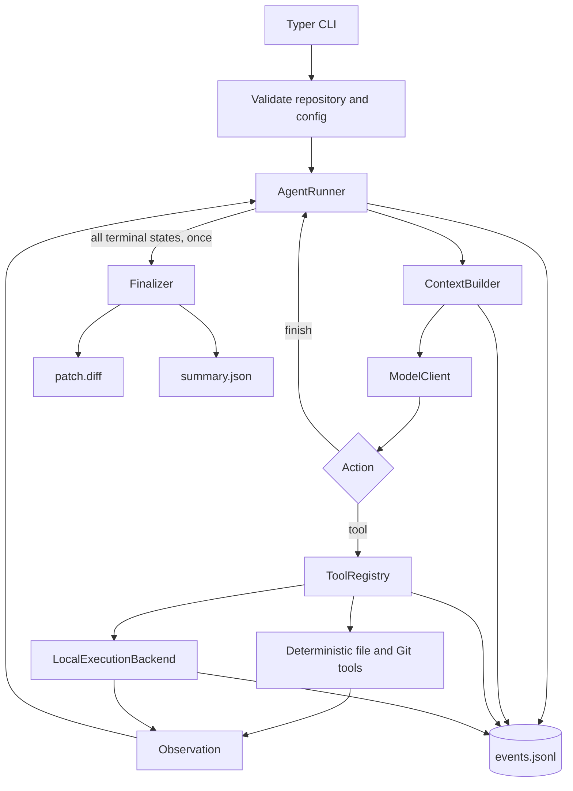

## Context

This is a greenfield, Windows-first CLI project. See `proposal.md` for motivation and the four delta specs for observable behavior. The first release must complete one local coding-task loop and produce inspectable evidence; FastAPI, web replay, SWE-bench integration, and sandboxing are later changes.

The design is reference-driven but independently implemented:

- mini-SWE-agent contributes the minimal `query -> action -> environment -> observation` loop, explicit limits and termination, and serialized trajectories.
- SWE-agent contributes the separation of raw trajectory from model-visible history, the execution boundary, and evaluation as a separate step from patch generation.
- Aider contributes checked edit semantics and the principle that repository context must be selected to fit a budget; its AST/graph RepoMap is deferred.
- SWE-ReX motivates one narrow execution protocol so a later sandbox backend does not alter agent control flow.

## Goals / Non-Goals

**Goals:**

- Keep the complete control flow understandable in one small runner module.
- Make model behavior reproducible in tests through a scripted model client.
- Separate task state, model-visible context, repository retrieval, and persisted run artifacts.
- Normalize all expected model, tool, and command failures into observations.
- Preserve only the extension seams already required by external variability: model endpoint and execution backend.

**Non-Goals:**

- Crash recovery, run resumption, database-backed event sourcing, background workers, or concurrent runs.
- A general strategy/plugin framework; MVP has one ReAct policy.
- Semantic/vector retrieval, AST indexing, RepoMap ranking, or persistent memory.
- Docker, remote execution, worktrees, approvals, MCP, skills, multi-agent orchestration, API, or web UI.

## Decisions

### 1. Use one synchronous application flow

`cli -> run_task -> AgentRunner.run -> artifacts` is a synchronous call chain. Typer performs input/config parsing and composition only; it contains no agent logic. The runner owns the loop and calls small collaborators directly.

Alternative considered: an async workflow engine with queues and resumable nodes. Rejected because MVP has one local run, no server, and no recovery requirement. Synchronous code is easier to debug and test; subprocess timeouts still work without making the entire domain async.

### 2. Keep a single ReAct runner, not a Strategy abstraction

The model returns exactly one discriminated action per step:

```text
ToolAction { kind: "tool", tool: str, arguments: object }
FinishAction { kind: "finish", summary: str }
```

`AgentRunner` validates the response, dispatches a tool action, converts the result to an observation, updates state, and repeats. A malformed response becomes a format-error observation and consumes a model step. Completion, limits, cancellation, and fatal infrastructure errors all converge on one finalization path.

Alternative considered: `Strategy` plus ReAct and planner/executor implementations. Rejected until a second real strategy exists. A future strategy can replace the runner's private `decide_next_action` boundary after failure evidence identifies what must vary.

### 3. Represent lifecycle explicitly without using exceptions as normal control flow

```text
RunStatus = starting | running | completed | step_limit |
            budget_limit | cancelled | failed

RunState
  run_id: UUID
  repo_root: resolved Path
  base_commit: str
  task: str
  status: RunStatus
  step_count: int
  limits: RunLimits
  usage: ModelUsage
  recent_observations: deque[Observation]
  pinned_context: ordered map[ContextKey, ContextItem]
  latest_test_result: CommandResult | None
  changed_files: ordered set[str]
  started_at: UTC datetime
  finished_at: UTC datetime | None
  termination_reason: str | None
```

`RunState` is the current in-memory control state. It is not the trajectory and is not reconstructed from events in MVP. State transitions are runner methods with explicit preconditions; terminal states are immutable.

Alternative considered: mini-SWE-agent-style flow-control exceptions. They keep a tiny loop compact, but explicit status transitions are easier to assert, expose later through an API, and explain in a resume project. Exceptions remain for unexpected infrastructure faults only.

### 4. Derive Working Context; do not call it memory

`ContextBuilder.build(state)` produces messages for one model call from four ordered sections:

1. immutable system instructions and tool contracts;
2. immutable task plus remaining step/budget information;
3. pinned code returned by successful `read_file` calls and retained by the deterministic policy below;
4. a recency window of actions/observations, always retaining the latest test or command result.

The builder applies deterministic priority and truncation under a configurable character budget. `pinned_context` is keyed by repository-relative path and ordered by the most recent successful `read_file`: reading the same path replaces its previous content and moves it to the newest position. If pinned content exceeds its assigned character budget, the builder evicts least-recently-read paths until it fits. Edited files receive no hidden priority and must be read again to refresh their pinned content. System instructions, task/limits, and the latest test result are separate mandatory sections and are never displaced by pinned files. The builder records explicit elision markers instead of summarizing or ranking with another model, embeddings, or heuristics. API-reported token usage is measured separately; tokenizer-aware budgeting is deferred until real traces show the character budget is inadequate.

This creates clear boundaries:

- **State:** current control facts and counters.
- **Working Context:** ephemeral messages for the next model call.
- **Code Retrieval:** explicit `list_files`, `search_code`, and `read_file` calls against current files.
- **Persistent Memory:** absent from MVP.

Alternative considered: feed the full trajectory on every step. Rejected because verbose command output grows without bound. Also rejected: vector RAG and Aider's graph-ranked RepoMap, because the baseline must first reveal whether explicit search/read is insufficient.

### 5. Use a function registry, not a plugin system

```text
ToolDefinition
  name: str
  description: str
  input_schema: JSON Schema
  handler: (ToolContext, arguments) -> ToolResult

ToolResult
  ok: bool
  summary: str
  data: JSON object
  error_code: str | None
  truncated: bool

ToolContext
  repo_root: Path
  execution_backend: ExecutionBackend
  command_policy: CommandPolicy
  event_writer: EventWriter
```

`ToolRegistry` is an immutable name-to-definition mapping created at startup. It validates arguments and catches known operational errors before returning `ToolResult`. The six built-ins are:

```text
list_files(path=".", pattern=None, max_results=200)
search_code(query, path=".", glob=None, max_results=100)
read_file(path, start_line=1, end_line=None, max_chars=20000)
edit_file(path, operation="replace"|"create", expected_text=None, new_text)
run_command(executable, args=[], cwd=".", timeout_seconds=None)
git_diff()
```

`edit_file` uses exact, unique replacement. This borrows Aider's core lesson that edit application must be checked, while omitting its model-specific edit formats. Tools are normal deterministic functions, not agents and not dynamically installed plugins.

### 6. Isolate host execution behind one narrow protocol

```text
ExecutionBackend.run(CommandRequest) -> CommandResult

CommandRequest
  executable: str
  args: tuple[str, ...]
  cwd: repository-relative Path
  timeout_seconds: float
  output_limit_bytes: int

CommandResult
  status: exited | timed_out | blocked | spawn_failed
  exit_code: int | None
  stdout: str
  stderr: str
  duration_ms: int
  stdout_truncated: bool
  stderr_truncated: bool
```

`LocalExecutionBackend` resolves the working directory inside the repository, asks `CommandPolicy` to validate executable and arguments, starts the process with `shell=False`, captures output, and kills the Windows process tree on timeout. Default policy permits only narrow test/read-only development command prefixes such as `python -m pytest`, `pytest`, and configured lint/type-check commands. Model actions cannot modify the policy.

The backend is not a sandbox. Documentation must say to run only on trusted repositories. A future `DockerExecutionBackend` or `LinuxRemoteExecutionBackend` implements the same request/result protocol.

Alternative considered: abstract filesystem, shell sessions, deployment lifecycle, and remote transport now. Rejected as a partial reimplementation of SWE-ReX with no MVP consumer.

### 7. Record lightweight JSONL events, not event sourcing

```text
RunEvent
  schema_version: "1"
  run_id: UUID
  sequence: int
  timestamp: UTC datetime
  type: EventType
  payload: JSON object
```

`EventWriter.append(type, payload)` serializes one validated envelope and flushes it to `events.jsonl`. Small helper functions construct the nine specified event payloads; there is no event bus, subscriber framework, reducer, database, snapshot, or replay-driven state reconstruction.

Events are emitted at boundaries:

- runner: `TaskStarted` and `ModelStep` only;
- registry/tools: `ToolCalled`, `ToolResult`, `FileEdited`;
- backend/tool adapter: `CommandExecuted`, and `TestResult` when the command policy classifies a command as a test;
- finalizer: the sole owner of `AgentFinished` or `AgentFailed`, followed by `patch.diff` and `summary.json`.

Every terminal status (`completed`, `step_limit`, `budget_limit`, `cancelled`, or `failed`) is passed exactly once to `Finalizer.finalize`. The runner selects the status and reason but MUST NOT append a terminal event or write final artifacts. The finalizer collects the current diff, maps `completed` to `AgentFinished` and every other terminal status to `AgentFailed`, appends exactly one terminal event, closes the event writer, writes `patch.diff`, and atomically writes `summary.json`. A finalizer instance rejects a second call for the same run, preventing duplicate terminal events. A hard process kill or artifact I/O failure may still leave an incomplete run; readers classify it as incomplete rather than synthesizing success.

The raw model response may be recorded after secret redaction. Large tool output is bounded in events, with truncation flags. Full unbounded subprocess output is not persisted in MVP.

### 8. Keep model integration behind a small client protocol

```text
ModelClient.complete(messages, tool_schemas) -> ModelResponse

ModelResponse
  action: ToolAction | FinishAction
  raw_response_id: str | None
  usage: ModelUsage
```

The production adapter targets an OpenAI-compatible endpoint. `ScriptedModelClient` returns queued responses for tests. There is no provider registry, retry middleware framework, or model routing. Transport retries are bounded and limited to transient API failures; every successful or failed model step remains visible to the runner.

### 9. Separate patch generation from evaluation

The agent's finish action ends generation but does not establish correctness. A small evaluator copies or creates each fixture repository, runs the agent, then independently executes the fixture oracle and reads the generated artifacts. SWE-bench Lite later consumes patches through a separate Linux-runner integration.

This follows SWE-agent's separation between trajectory/prediction generation and benchmark evaluation while keeping the initial evaluator local and deterministic.

### 10. Core data flow



### 11. Directory structure

```text
pyproject.toml
src/coding_agent/
  cli.py                     # input parsing and dependency composition
  config.py                  # validated run/model/tool limits
  agent/
    runner.py                # the only ReAct loop
    state.py                 # RunState, limits, status transitions
    actions.py               # ToolAction, FinishAction, Observation
  context/
    builder.py               # deterministic working-context selection
  models/
    base.py                  # ModelClient protocol and response types
    openai_compatible.py     # production adapter
    scripted.py              # deterministic test adapter
  tools/
    registry.py              # ToolDefinition and dispatch
    files.py                 # list/search/read/edit
    commands.py              # run_command adapter
    git.py                   # git_diff and baseline checks
    paths.py                 # canonical confinement helper
  execution/
    base.py                  # request/result and ExecutionBackend protocol
    local.py                 # Windows-local subprocess execution
    policy.py                # immutable command allow rules
  events/
    models.py                # event envelope and event names
    writer.py                # append-only JSONL writer
    artifacts.py             # patch and summary finalization
  evaluation/
    fixtures.py              # local task manifests and fixture setup
    runner.py                # independent success oracle and metrics
tests/
  unit/
  behavior/
  e2e/
  fixtures/tasks/
openspec/
```

Files should remain focused; split only when a file acquires a second responsibility, not to mirror every type with its own module.

### 12. Minimal test design

**Unit tests**

- Path resolution rejects absolute, traversal, symlink, and junction escapes.
- Each tool returns stable results, truncation metadata, and normalized failures.
- Checked replacement is atomic on absent or ambiguous expected text.
- Command policy blocks shell syntax and unapproved prefixes.
- Local backend captures both streams, returns non-zero exits, times out, and cleans child processes.
- Event writer produces valid, ordered JSONL and redacts configured secrets.
- State transitions cannot leave a terminal state or exceed the step limit.
- Context builder retains mandatory sections and deterministically elides old output.

**Agent behavior tests with `ScriptedModelClient`**

- read -> edit -> test -> finish;
- search -> read -> edit;
- failing test -> inspect -> repair -> passing test -> finish;
- malformed action -> correction;
- tool failure -> recovery;
- step limit -> terminal artifact.

**Minimal end-to-end fixtures**

- fix an off-by-one function;
- add a missing regression test without changing production behavior;
- change a function contract across implementation and tests.

Each fixture is initialized as a clean temporary Git repository. The evaluator uses an oracle command not exposed as proof from the model's finish text. CI runs unit, behavior, and fixture tests without a network key. A live-model smoke run is manual and non-blocking.

### 13. Architecture review and simplification

The following abstractions were removed from the earlier architecture:

- **Strategy interface:** one implementation has no polymorphism requirement; the runner directly owns ReAct.
- **Application service:** the CLI can compose and call the runner directly until FastAPI exists.
- **Repository abstraction:** tools operate on one resolved root; only path confinement is shared.
- **Event bus/event store:** one append-only writer is sufficient.
- **State reducer from events:** events support inspection, not recovery.
- **Provider registry:** one OpenAI-compatible adapter plus one scripted test double is sufficient.
- **Tokenizer service:** deterministic character budgeting is sufficient for the baseline.
- **RepoMap/retriever hierarchy:** explicit search/read provides the baseline whose failures can justify V2 retrieval.
- **Async orchestration and cancellation API:** synchronous Ctrl+C handling is sufficient for CLI MVP.
- **FastAPI/web schema:** deferred so presentation work cannot constrain the core event format prematurely.

The remaining protocols are justified by current external boundaries, not speculative extensibility: `ModelClient` is required for network-free behavior tests, and `ExecutionBackend` is required to test timeout/policy behavior and later run Linux evaluation without changing the loop.

## Risks / Trade-offs

- [Host execution can damage a machine or files outside the repository through trusted test code] -> Document the trusted-repository boundary, use narrow command prefixes, disable shell parsing, and add a sandbox backend before supporting untrusted repositories.
- [Refusing dirty repositories limits convenience] -> Prefer preservation of user changes; worktree support can later remove this constraint.
- [Exact replacement can fail on repeated or drifting text] -> Return an edit-conflict observation; evaluate real failures before adding patch/hunk formats.
- [Character budgeting is not exact token budgeting] -> Keep a conservative limit, record API usage, and replace it only if traces demonstrate context-limit failures.
- [One-action-per-step may increase latency] -> It simplifies attribution and trajectories; measure step and token cost before considering parallel tool calls.
- [JSONL can end without a terminal event after a hard kill] -> Readers explicitly classify such runs as incomplete; durable recovery is not an MVP requirement.
- [A 3-task fixture set has weak external validity] -> Use it only for engineering correctness, then add the separate 10-task SWE-bench Lite evaluation on Linux.

## Migration Plan

This is a new project, so no data migration is required. Implementation proceeds in vertical slices that leave a runnable test suite after each slice. Run artifacts carry `schema_version: "1"`; incompatible future changes introduce a new reader/version rather than rewriting existing trajectories.
